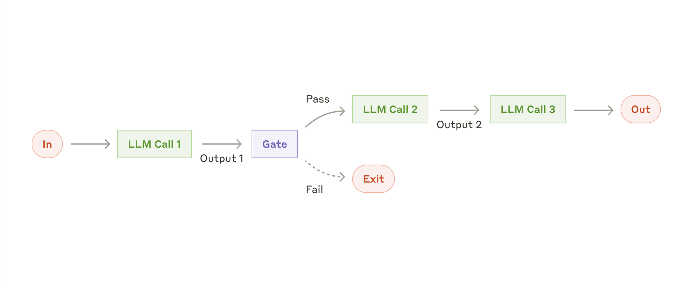
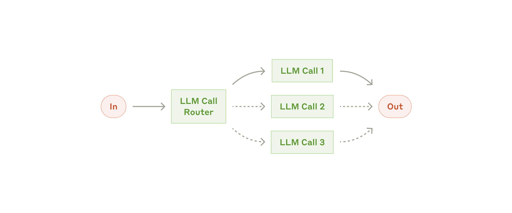
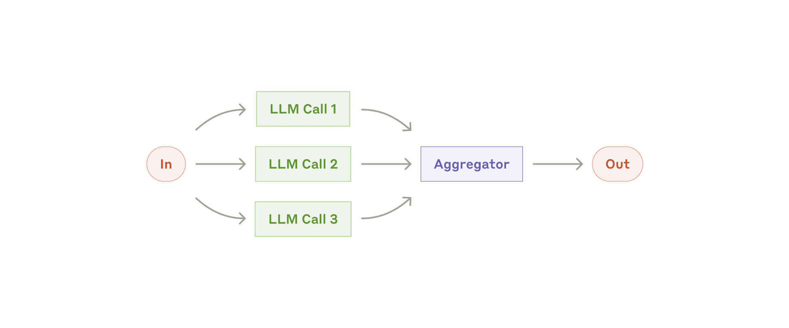
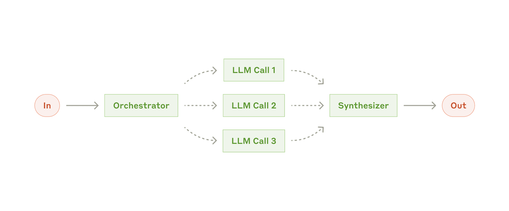
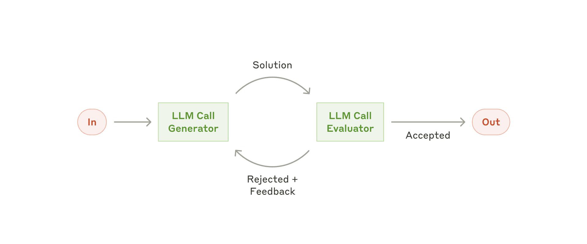

<!-- _class: lead -->
<!-- _paginate: false -->

# 第3-4课时｜工作流与RAG
## MBA《大模型智能体》

**主题**：从"会聊天"到"会完成任务"
**时长**：90分钟（含动手）

---

# 今天你将掌握什么？

1. 为什么单次LLM调用在企业中不够用
2. Anthropic定义的**5种核心工作流模式**
3. RAG原理：检索、向量化、分块、生成
4. RAG前沿：GraphRAG、Agentic RAG、多跳检索
5. 如何把工作流 + RAG落到真实业务

---

# 课程结构（90分钟）

| 模块 | 内容 | 时间 |
|---|---|---|
| A | 为什么需要工作流 | 10 min |
| B | Anthropic 5种工作流模式 | 25 min |
| C | RAG原理与前沿技术 | 30 min |
| D | 场景落地与实操 | 20 min |
| E | 总结与讨论 | 5 min |

---

<!-- _backgroundColor: #0f172a -->
<!-- _color: #f1f5f9 -->

# Part A｜为什么需要工作流

单次LLM调用的天然短板，以及工作流如何弥补

---

# 先做一个判断题

> "只要Prompt写得好，复杂业务也能一次调用搞定。"

- A. 正确
- B. 错误

**答案**：B（大多数企业任务都需要多步骤编排）

---

# 单次调用的4个天然短板

| 短板 | 结果 |
|---|---|
| 上下文有限 | 长文档/多文档处理不完整 |
| 知识陈旧 | 无法回答最新事实 |
| 无状态执行 | 难以跟踪任务进度 |
| 缺乏动作能力 | 不能主动调用系统完成任务 |

---

# 短板拆解

**上下文不是无限的**
- 企业常见输入：合同包、财报合集、历史工单
- 即使上下文很大：费用↑ 速度↓ 注意力稀释

**模型不知道"你公司内部"的知识**
- 预训练知识有截止日期
- 内部制度/产品手册不在公开语料

> 结论：必须做任务分解与检索

---

# 复杂任务不是一句话

典型任务："帮我写竞品分析并给出行动建议"

隐藏步骤：
1. 收集信息 → 2. 交叉验证 → 3. 结构化分析 → 4. 格式化输出 → 5. 人工复核

**一步到位的风险**：
- 无法定位错误发生在哪一步
- 无法给出可审计的中间结果
- 无法设置"人工审批点"

> **企业需要**：可追踪、可回溯、可治理

---

# 什么是工作流（Workflow）

**定义**：把复杂任务拆成多个可执行节点，并定义节点之间的依赖关系。

```text
输入 → 节点1(提取) → 节点2(分析) → 节点3(生成) → 输出
```

工作流强调：
- 流程确定性
- 中间产物可见
- 错误可恢复

---

# 工作流带来的商业价值

<span class="kpi">准确率↑</span><span class="kpi">一致性↑</span><span class="kpi">风险↓</span><span class="kpi">可维护性↑</span>

1. **结果更稳定**：标准化流程
2. **团队可协作**：节点职责清晰
3. **可持续优化**：可替换单个节点
4. **可运营**：可监控每一步成本与时延

---

<!-- _backgroundColor: #0f172a -->
<!-- _color: #f1f5f9 -->

# Part B｜Anthropic 5种工作流模式

业界最权威的Agentic工作流分类框架

<div class="tiny" style="color:#94a3b8;">来源: Anthropic - Building Effective Agents (2024)</div>

---

# Anthropic 5种核心工作流模式

| 模式 | 核心思想 | 典型用途 |
|---|---|---|
| **Prompt Chaining** | 顺序步骤，每步输出→下步输入 | 文档处理链 |
| **Routing** | 分类输入，路由到专门流程 | 客服分流 |
| **Parallelization** | 同一任务多路并行，结果聚合 | 多源分析 |
| **Orchestrator-Workers** | 中央编排器动态分配子任务 | 复杂项目 |
| **Evaluator-Optimizer** | 生成-评估-优化迭代循环 | 内容精炼 |

<div class="tiny muted">来源: <a href="https://www.anthropic.com/engineering/building-effective-agents">Anthropic - Building Effective Agents (2024)</a></div>

---

# 模式一：Prompt Chaining（提示链）

将任务分解为顺序步骤，每步的输出是下步的输入，中间可设质量门控。



<div class="tiny muted">来源: <a href="https://www.anthropic.com/engineering/building-effective-agents">Anthropic - Building Effective Agents (2024)</a></div>

---

# Prompt Chaining 设计要点

```text
用户输入 → 信息抽取 → 事实核验 → 结论生成 → 格式化输出
```

**适用条件**：上下游强依赖、需逐步精炼

**设计原则**：
1. 每个节点只做一件事（单一职责）
2. 中间结果结构化（JSON优先）
3. 关键节点设置**质量门控**（Gate）
4. 失败节点支持重试和降级

---

# Prompt Chaining 示例：研报生成

| 节点 | 输入 | 输出 |
|---|---|---|
| N1 数据收集 | 公司名 | 原始资料包 |
| N2 事实整理 | 资料包 | 结构化事实表 |
| N3 分析推理 | 事实表 | SWOT结论 |
| N4 报告成稿 | SWOT | Markdown摘要 |

```python
facts = extract(raw_docs)
checked = verify(facts)        # 质量门控
analysis = reason(checked)
report = format_report(analysis)
```

---

# 动手试试 1：Prompt Chaining

<div class="try">

**平台**：[DeepSeek](https://chat.deepseek.com) / [Kimi](https://kimi.moonshot.cn)

**任务**：以某上市公司生成简报
1) 先提取事实 → 2) 做SWOT → 3) 生成500字摘要

对比"一次性写完" vs "链式执行"的质量差异。

</div>

---

# 模式二：Routing（路由分发）

对输入进行分类，路由到专门的处理流程。低置信度走兜底路径。



<div class="tiny muted">来源: <a href="https://www.anthropic.com/engineering/building-effective-agents">Anthropic - Building Effective Agents (2024)</a></div>

---

# Routing 设计要点

```text
输入请求 → 意图识别
             ├─ 售后问题 → 售后流程
             ├─ 购买咨询 → 销售流程
             └─ 投诉升级 → 人工专席
```

**分类标准**：
- 标签互斥且穷尽（MECE）
- 置信度阈值明确
- 低置信度走"兜底路径"

> 不确定时，宁可转人工，不要乱答。

---

# Routing 实现策略

| 策略 | 优点 | 风险 |
|---|---|---|
| 规则优先（关键词） | 稳定可控 | 覆盖有限 |
| LLM分类 | 灵活 | 一致性波动 |
| 混合策略 | 平衡稳定与灵活 | 系统更复杂 |

```python
intent, score = classify(user_query)
if score < 0.65:
    return handoff_to_human(user_query)
elif intent == "refund":
    return refund_workflow(user_query)
```

---

# 动手试试 2：做一个客服Router

<div class="try">

**平台**：[OpenAI Playground](https://platform.openai.com/playground) / [Claude](https://claude.ai)

**任务**：把用户消息分到 `退款/咨询/投诉/其他`，输出JSON：
`{"intent":...,"confidence":...,"reason":...}`

</div>

---

# 模式三：Parallelization（并行化）

同一任务拆分多路并行处理，结果聚合。包括两种形式：
- **Sectioning**：任务拆分为独立子任务
- **Voting**：同一任务多次运行取共识



<div class="tiny muted">来源: <a href="https://www.anthropic.com/engineering/building-effective-agents">Anthropic - Building Effective Agents (2024)</a></div>

---

# Parallelization 设计要点

```text
            ┌→ 财务分析 ─┐
用户问题 ───┼→ 舆情分析 ─┼→ 汇总器 → 统一回答
            └→ 产品分析 ─┘
```

**适用场景**：
- 多来源搜索（新闻+财报+论坛）
- 多角色评审（法务+财务+业务）
- 多假设评估（乐观/中性/悲观）

**核心问题**：结果冲突如何处理？→ 置信度排序 + 引用来源优先

---

# 动手试试 3：多角度并行分析

<div class="try">

**平台**：[Kimi](https://kimi.moonshot.cn) / [Gemini](https://gemini.google.com)

**任务**："AI手机2026年的机会点是什么？"
分别从技术、渠道、用户、监管四角度独立产出，再统一汇总。

</div>

---

# 模式四：Orchestrator-Workers（编排-执行）

中央编排器分析任务，**动态**分配子任务给专门的workers，汇总结果。



<div class="tiny muted">来源: <a href="https://www.anthropic.com/engineering/building-effective-agents">Anthropic - Building Effective Agents (2024)</a></div>

---

# Orchestrator-Workers vs Parallelization

| 维度 | Parallelization | Orchestrator-Workers |
|---|---|---|
| 子任务 | 预先确定 | 动态拆解 |
| 灵活性 | 中 | 高 |
| 编排器 | 简单合并 | LLM驱动规划 |
| 适用 | 已知维度并行 | 开放性复杂任务 |

**典型场景**：编程Agent（分析→规划→多文件编辑→集成测试）

---

# 模式五：Evaluator-Optimizer（评估-优化）

生成→评估→反馈→再生成的迭代循环，直到满足质量标准。



<div class="tiny muted">来源: <a href="https://www.anthropic.com/engineering/building-effective-agents">Anthropic - Building Effective Agents (2024)</a></div>

---

# Evaluator-Optimizer 设计要点

```text
Generator → Output → Evaluator → Feedback
    ↑                               │
    └───────── 迭代循环 ─────────────┘
```

**适用条件**：
- 有明确的评估标准（如代码是否通过测试）
- 迭代改进能带来可衡量的提升
- 可设置最大迭代次数防止死循环

**典型场景**：翻译润色、代码生成、文案优化

---

# 五种模式如何组合？

企业真实流程通常是多模式嵌套：

```text
Routing(分流) → Parallelization(并行取数) 
  → Prompt Chaining(串行成稿) → Evaluator-Optimizer(质量打磨)
```

**MBA建议**：从简单模式开始，渐进组合

---

# 工作流质量指标（业务视角）

| 指标 | 解释 |
|---|---|
| 成功率 | 任务最终完成比例 |
| 一次通过率 | 无需人工返工 |
| 平均耗时 | 从输入到输出 |
| 单任务成本 | API+算力+人工 |
| 可解释性 | 能否追踪证据链 |

---

# 工作流 vs Agent

| 维度 | 工作流 | Agent |
|---|---|---|
| 决策路径 | 预定义 | 动态规划 |
| 可靠性 | 高 | 中 |
| 灵活性 | 中 | 高 |
| 治理成本 | 低 | 高 |

**策略**：先工作流保底，后Agent增强。
- **Workflow优先**：标准化流程、监管要求高、容错低
- **Agent优先**：探索性任务、开放目标、路径不确定

---

<!-- _backgroundColor: #0f172a -->
<!-- _color: #f1f5f9 -->

# Part B+｜低代码工作流实战：Coze

字节跳动推出的AI Bot开发平台，5种模式可视化落地

---

# Coze 平台概览

**Coze** 提供可视化工作流编排，无需代码即可实现五种工作流模式。

| 特点 | 说明 |
|------|------|
| **可视化编排** | 拖拽式节点连接 |
| **多模型支持** | 豆包、GPT、Claude等 |
| **插件生态** | 100+官方插件 |
| **一键发布** | 飞书、微信、网页 |

入口：[coze.cn](https://www.coze.cn)（国内）/ [coze.com](https://www.coze.com)（海外）

---

# Coze 核心概念与节点类型

| 概念 | 说明 | 类比 |
|------|------|------|
| **Bot** | 完整AI应用 | 小程序 |
| **Workflow** | 可视化流程编排 | 流程图 |
| **Plugin** | 调用外部能力 | API接口 |
| **Knowledge** | 知识库（RAG） | 参考资料 |

**节点类型**：LLM / Code / Knowledge / Plugin / Condition / Loop / Variable

---

# Coze 案例：智能客服 → 投研助手

**案例1：电商客服**（Routing模式）
```text
用户提问 → 意图识别(LLM) → 条件分支
  ├─ 退换货 → 查订单(Plugin) → 回复
  ├─ 物流 → 快递API → 回复
  └─ 其他 → 知识库检索 → 回复
```
效果：80%自动解决，响应<3秒

**案例2：投研助手**（Parallelization模式）
```text
公司名 → 并行[财报+新闻+研报+竞品] → 综合分析 → 研报
```
效果：5分钟初步调研，数据可追溯

---

# Coze 案例：日报生成 → 会议纪要

**案例3：行业日报**（Parallelization + Chaining）
```text
定时触发 → 并行[科技+财经+政策]新闻搜索 → 摘要生成 → 汇总排版 → 推送
```

**案例4：会议纪要**（Chaining + Parallelization）
```text
音频 → 转文字 → 并行[提取要点/待办/决议] → 格式化 → 发送
```

---

# 动手试试 4：Coze快速上手

<div class="try">

**平台直达**：[coze.cn](https://www.coze.cn)

**10分钟任务**：
1. 创建新Bot，添加Workflow：`输入 → LLM → 输出`
2. 测试对话效果
3. 添加Plugin节点（如搜索）
4. 添加Condition节点实现简单Routing

</div>

---

<!-- _backgroundColor: #0f172a -->
<!-- _color: #f1f5f9 -->

# Part C｜RAG原理与前沿技术

从基础检索增强生成到2026年最新进展

---

# 为什么要学RAG？

即使工作流设计很好，知识来源不可靠 → 输出不可靠。

**RAG = Retrieval + Generation**
- 检索（Retrieval）：找到最相关资料
- 生成（Generation）：基于资料组织回答

> 核心不是"更会写"，而是"更会找"。

---

# RAG与纯LLM的差异

| 方式 | 数据来源 | 可追溯性 | 幻觉风险 |
|---|---|---|---|
| 纯LLM | 参数记忆 | 弱 | 高 |
| RAG | 外部知识库 + 参数 | 强 | 低 |

---

# RAG总架构（两阶段）

```text
离线阶段：文档清洗 → 分块 → 向量化 → 建索引
在线阶段：问题向量化 → 检索TopK → 重排 → 生成回答
```

- 离线决定"搜得全不全"
- 在线决定"答得准不准"

---

# 离线阶段：索引（Indexing）

1. **文档采集**：PDF、网页、表格、知识库
2. **文本清洗**：去噪、去模板、补元数据
3. **分块**：控制粒度与上下文完整性
4. **向量化**：文本转Embedding
5. **存储**：向量库 + 元数据索引

---

# 在线阶段：检索 → 生成

**检索流程**：
1. Query理解与改写 → 2. 召回Top-K → 3. 重排Re-rank → 4. 组装上下文

**生成约束**：
- 明确引用来源
- 对不确定信息说"不知道"
- 推荐提示词：`若资料缺失，请明确说明"未在检索结果中找到证据"。`

---

# 向量化（Embedding）是什么？

把文本映射到高维向量空间：语义相近→距离近

```text
"苹果是一种水果"  ↔  "香蕉是一种水果" （近）
"苹果是一种水果"  ↔  "债券收益率曲线" （远）
```

| 模型 | 维度 | 特点 |
|------|------|------|
| OpenAI text-embedding-3-large | 3072 | 多语言强 |
| BGE-M3 | 1024 | 中文优化，开源 |
| Jina-embeddings-v3 | 1024 | 长文本支持 |
| GTE-Qwen2 | 1024 | 阿里开源，中文强 |

---

# 向量数据库选型

| 数据库 | 特点 | 适用场景 |
|--------|------|----------|
| Milvus | 分布式，高性能 | 大规模生产 |
| pgvector | PostgreSQL扩展 | 已有PG基础设施 |
| Qdrant | Rust实现，快速 | 中等规模 |
| Chroma | 轻量级 | 原型开发 |
| Pinecone | 全托管SaaS | 快速上线 |

**Top-K建议**：召回K=20，重排后取Top 5~8进入生成

---

# 重排（Re-rank）为什么重要？

**流程**：粗召回（快）→ 精重排（准）

- 显著提升最终答案质量
- 降低"看似相关但其实无关"的干扰
- 常用模型：Cohere Reranker、BGE-Reranker

---

# 分块（Chunking）策略

分块是RAG效果的"地基"：太大→召回粗糙，太小→语义断裂

| 策略 | 做法 | 适用场景 |
|---|---|---|
| 固定长度 | 每N字切分 | 快速起步 |
| 段落切分 | 按自然段/标题 | 文档结构清晰 |
| 语义切分 | 根据语义变化切 | 精度优先 |
| 混合切分 | 标题+长度+重叠 | 生产环境常用 |

**经验值**：中文300~800字/块，重叠10%~20%

---

# 结构化文档的分块技巧

针对合同/财报/手册：
1. 先按章节标题切分
2. 保留层级路径（如`3.2.1`）
3. 块内附带元数据（页码、版本、日期）

> 元数据是后续引用与审计的关键

---

# 动手试试 5：Chunk参数实验

<div class="try">

**平台**：[Dify](https://dify.ai) / [Coze](https://www.coze.cn)

**任务**：同一文档尝试两组参数：
A: `chunk=300 overlap=30` ｜ B: `chunk=800 overlap=120`
比较：召回相关性、回答完整性、延迟。

</div>

---

# Query改写：让"搜"更聪明

用户问题常常过短、过口语化，可先做：
- 关键词扩展 + 同义词补全 + 时间范围补充

```text
"这家公司最近怎么样" 
→ "公司近12个月营收、利润、重大事件"
```

---

<!-- _backgroundColor: #0f172a -->
<!-- _color: #f1f5f9 -->

# Part C+｜RAG前沿技术（2026）

从基础RAG到GraphRAG、Agentic RAG、多跳检索

---

# 混合检索：Hybrid Search

**Dense（向量）+ Sparse（BM25）+ 知识图谱**已成为2026年标准方案。

| 检索方式 | 擅长 | 弱点 |
|----------|------|------|
| Dense（向量） | 语义相似 | 专有名词匹配差 |
| Sparse（BM25） | 精确词匹配 | 不理解同义词 |
| Graph（图谱） | 关系推理 | 构建成本高 |

**最佳实践**：三路召回 + 统一重排

---

# Contextual Retrieval（Anthropic）

**问题**：传统RAG分块会丢失上下文

```text
原始chunk: "The company's revenue grew by 3%..."
→ 哪家公司？哪个季度？信息丢失！
```

**解决方案**：用LLM为每个chunk生成上下文前缀

| 方法 | Top-20检索失败率 |
|------|------------------|
| 传统RAG | 5.7% |
| + Contextual Embeddings | 3.7% (↓35%) |
| + Contextual BM25 | 2.9% (↓49%) |
| + Reranking | **1.9%** (↓67%) |

<div class="tiny muted">来源: <a href="https://www.anthropic.com/engineering/contextual-retrieval">Anthropic - Contextual Retrieval (2024)</a></div>

---

# GraphRAG（微软）

**核心思想**：用知识图谱增强RAG，通过图结构捕捉实体间关系。

```text
传统RAG：文档 → 分块 → 向量 → 检索
GraphRAG：文档 → 实体抽取 → 构建知识图谱 → 社区摘要 → 检索
```

**优势**：
- 擅长回答需要跨文档关联的问题
- "XX公司的供应商中，谁也是YY的客户？"
- 全局性问题（"整个行业的核心趋势？"）效果显著提升

<div class="tiny muted">来源: <a href="https://www.microsoft.com/en-us/research/blog/graphrag-unlocking-llm-discovery-on-narrative-private-data/">Microsoft Research - GraphRAG (2024)</a></div>

---

# Agentic RAG

**核心思想**：Agent自主决定何时检索、检索什么、如何组合。

```text
传统RAG: Query → 检索 → 生成（固定流程）
Agentic RAG: Query → Agent判断 → [检索/计算/搜索/跳过] → 组合 → 生成
```

**Agent能力**：
- 判断是否需要检索（简单问题直接回答）
- 动态改写Query，多次检索
- 选择不同知识源（内部文档/网页/数据库）
- 验证检索结果的相关性

---

# Multi-hop RAG（多跳检索）

**问题**：复杂问题需要多次检索、逐步推理

```text
Q: "在Q3营收超过100亿的公司中，哪家研发投入占比最高？"

Step 1: 检索 → 找到Q3营收超100亿的公司列表
Step 2: 检索 → 逐个查询研发投入数据
Step 3: 推理 → 计算占比并排序
```

**关键技术**：
- 问题分解（Decomposition）
- 中间结果缓存
- 推理链追踪

---

# RAG技术演进全景

| 阶段 | 代表 | 特点 |
|------|------|------|
| **基础RAG** | 向量检索+生成 | 简单有效 |
| **Advanced RAG** | Query改写+重排+Hybrid Search | 质量提升 |
| **Contextual RAG** | 上下文增强分块 | 减少信息丢失 |
| **GraphRAG** | 知识图谱+社区摘要 | 关系推理 |
| **Agentic RAG** | Agent驱动的自主检索 | 灵活智能 |
| **Multi-hop RAG** | 多步推理检索 | 复杂问题 |

---

# RAG常见失败模式

| 失败模式 | 根因 | 对策 |
|---------|------|------|
| 检索不到 | Recall不足 | Hybrid Search + 扩召回 |
| 检索错了 | Precision不足 | Re-rank + Contextual |
| 生成胡说 | 未约束 | 引用强制 + Faithfulness评估 |
| 来源冲突 | 未做证据对齐 | 时间戳排序 + 可信度标记 |
| 过时文档 | 知识库未更新 | 自动化更新 + 过期降权 |

---

# 如何评估RAG效果？

| 维度 | 指标示例 |
|---|---|
| 检索层 | Recall@K, MRR, nDCG |
| 生成层 | Faithfulness, Answer Relevancy |
| 业务层 | 工单解决率、人工接管率 |

> 评估必须分层，不要只看"主观好不好"。

---

# 动手试试 6：搭一个迷你RAG Bot

<div class="try">

**平台**：[Dify Cloud](https://cloud.dify.ai) / [Coze](https://www.coze.cn)

**任务**：上传10页文档，配置知识库问答Bot，测试5个问题：
1) 是否给出处 2) 是否回答超范围问题 3) 是否出现幻觉

</div>

---

<!-- _backgroundColor: #0f172a -->
<!-- _color: #f1f5f9 -->

# Part D｜场景落地与实操

Workflow + RAG 如何在企业中落地

---

# Workflow + RAG 怎么结合？

```text
Routing → (RAG检索) → 分析节点 → 生成节点 → 审核节点
```

RAG不是独立产品，而是工作流中的"知识供给模块"。

---

# 企业参考架构（简版）

| 层 | 能力 |
|---|---|
| 接入层 | Chat / API / 企业IM |
| 编排层 | Workflow / Router / 监控 |
| 知识层 | 文档库 / 向量库 / 知识图谱 |
| 模型层 | Embedding + LLM + Re-ranker |
| 治理层 | 权限、审计、评估、告警 |

---

# 应用场景速览

| 场景 | 工作流模式 | RAG要点 | 收益 |
|------|-----------|---------|------|
| **智能客服** | Routing → Chaining | 知识条款检索 | 首响↑ 口径一致 |
| **投研助理** | Parallelization | 多源并行+事实依据 | 效率↑5x |
| **法务合同审查** | Chaining + Evaluator | 条款比对+案例检索 | 风险可追溯 |
| **员工知识助手** | Routing → RAG | 制度/SOP检索 | ROI最快 |

---

# 成本、安全与人在回路

**成本控制**：
- 小模型做分类/改写，大模型做最终生成
- 缓存高频问题，分级服务

**安全**：
- RBAC文档访问控制
- 敏感字段脱敏
- 全链路日志审计

**人在回路**：高风险结论 / 合同财务医疗 / 低置信度分支
> "全自动"不是目标，"可控自动化"才是目标。

---

# 从0到1实施路线图

**第1个月**：
1. 选一个高频低风险场景
2. 整理小规模高质量知识库
3. 搭建最小可用 Workflow + RAG
4. A/B测试与人工评估

**第1季度**：
- 增加场景覆盖（客服→法务→HR）
- 建立统一知识治理规范
- 建立评估看板与告警机制
- 推进组织培训与流程改造

---

# 常见反模式（Anti-pattern）

1. ❌ 一上来追求"全公司大一统平台"
2. ❌ 只看Demo，不看线上指标
3. ❌ 忽略知识更新机制
4. ❌ 不做权限隔离
5. ❌ 把Agent当"万能员工"

---

# MBA视角：你需要做的5个决策

1. **先切哪个场景？** → 高频低风险
2. **KPI如何定义？** → 分层指标
3. **谁负责知识治理？** → 明确owner
4. **风险红线在哪里？** → 人工审批点
5. **如何平衡效率与合规？** → 渐进策略

---

<!-- _backgroundColor: #0f172a -->
<!-- _color: #f1f5f9 -->

# Part E｜总结与讨论

---

# 小组讨论（8分钟）

请按小组回答：
1. 你们公司最适合先落地哪个场景？
2. 该场景的关键知识源是什么？
3. 哪个环节必须保留人工？
4. 预期3个月内能提升什么指标？

---

# 课堂练习任务卡

**任务**：设计一个"企业知识问答"最小流程图

输出要求：
- 至少包含 `Routing + RAG + 人工兜底`
- 给出3个关键指标
- 给出1个风险控制点

---

# 动手试试 7：可视化流程搭建

<div class="try">

**平台**：[Langflow](https://www.langflow.org) / [Flowise](https://flowiseai.com) / [n8n](https://n8n.io)

**任务**：画出并运行一个"查询→检索→回答→引用"的流程，截屏保存。

</div>

---

# 本课重点回顾

**工作流**：
- 5种模式是所有复杂编排的基础积木
- 从简单Prompt Chaining开始，渐进组合
- 企业落地先追求稳定，再追求自治

**RAG**：
- 本质是"把外部知识接入模型推理"
- 2026标准：Hybrid Search + Contextual Retrieval
- GraphRAG/Agentic RAG 应对复杂场景
- 评估与治理决定"能否规模化上线"

---

# 推荐阅读

- [Anthropic: Building Effective Agents (2024)](https://www.anthropic.com/engineering/building-effective-agents) ⭐
- [Anthropic: Contextual Retrieval (2024)](https://www.anthropic.com/engineering/contextual-retrieval)
- [Microsoft: GraphRAG (2024)](https://www.microsoft.com/en-us/research/blog/graphrag-unlocking-llm-discovery-on-narrative-private-data/)
- [RAG论文：Lewis et al. 2020](https://arxiv.org/abs/2005.11401)
- [Self-RAG (Asai et al., 2023)](https://arxiv.org/abs/2310.11511)
- [RAPTOR (Sarthi et al., 2024)](https://arxiv.org/abs/2401.18059)
- [LlamaIndex 文档](https://docs.llamaindex.ai) / [LangChain 文档](https://python.langchain.com)

---

# 课后作业（可选加分）

1. 选择一个你熟悉的业务场景
2. 画出Workflow流程图（至少6个节点，标注使用哪种模式）
3. 给出RAG知识源与分块方案
4. 提交1页"上线风险清单"

---

# 下一课预告

## 第5-6课时：Agent架构与工具调用

- Agent的规划、记忆、工具、反思
- 多智能体协作与失败恢复
- 企业级Agent治理框架

---

<!-- _class: lead -->
<!-- _backgroundColor: #0f172a -->
<!-- _color: #f1f5f9 -->
<!-- _color: #ffffff -->

# Q & A
## 谢谢大家

**你可以带走一句话：**
先把流程做对，再把智能做强。
