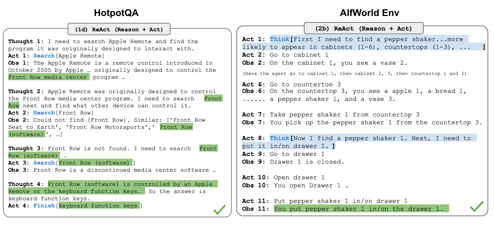

<!-- _class: lead -->
<!-- _paginate: false -->

# 第5-6课时｜大模型智能体架构
## ReAct · Reflexion · Plan-and-Execute · 工具调用（Tool Calling）

MBA《大模型智能体》

---

# 课程定位

- **主题**：让LLM从“会说”走向“会做”
- **对象**：产品经理、业务负责人、创业者
- **目标**：理解并能设计一个可落地的Agent系统
- **方式**：概念 + 框架 + 案例 + 动手

---

# 学习目标

完成本课后，你将能够：

1. 解释 **Agent 与 Workflow** 的本质区别
2. 画出 Agent 的核心架构（LLM/Memory/Tools/Planner）
3. 理解并复述 **ReAct、Reflexion、Plan-and-Execute**
4. 设计一个可执行的工具调用（Tool Calling）流程
5. 比较主流Agent产品并做选型

---

# 课程地图（90分钟）

| 模块 | 时间 | 产出 |
|---|---:|---|
| 1. Agent基础 | 15 min | 统一概念与边界 |
| 2. ReAct | 20 min | 理解循环式推理与行动 |
| 3. Reflexion | 15 min | 理解失败反思机制 |
| 4. Plan-and-Execute | 15 min | 掌握任务分解与重规划 |
| 5. 工具调用（Tool Calling） | 15 min | 设计可执行工具链 |
| 6. 产品对比 + 实战 | 10 min | 形成落地策略 |

---

# 先问一个问题

> “为什么同样是LLM，
> 有的产品只能回答问题，
> 有的却能自动帮你完成任务？”

核心差异：**控制流是否由LLM动态决定**。

---

# 01｜什么是Agent？

## 定义

**Agent 是一个用LLM来决定下一步行动的系统。**

- 能感知环境
- 能选择动作
- 能调用工具
- 能根据反馈持续迭代直到达成目标

---

# OpenAI官方定义 (2025)

> 📚 来源: [A Practical Guide to Building Agents](https://openai.com/business/guides-and-resources/a-practical-guide-to-building-ai-agents/)

**"Agents are systems that independently accomplish tasks on your behalf."**

| 核心特征 | 说明 |
|----------|------|
| **LLM驱动决策** | 用LLM管理工作流执行、做决策，识别何时完成 |
| **工具访问** | 动态选择合适工具与外部系统交互 |
| **自主纠错** | 识别错误并主动修正，必要时交还控制权 |
| **明确边界** | 在清晰定义的guardrails内运行 |

---

# Agent三大基础组件 (OpenAI)

```text
┌─────────────────────────────────────────┐
│              Agent                       │
│  ┌─────────┐  ┌─────────┐  ┌─────────┐  │
│  │  Model  │  │  Tools  │  │ Instruct│  │
│  │ (推理)  │  │ (能力)  │  │ (行为)  │  │
│  └─────────┘  └─────────┘  └─────────┘  │
└─────────────────────────────────────────┘
```

| 组件 | 作用 | 选择原则 |
|------|------|----------|
| **Model** | 推理引擎 | 先用最强模型建baseline，再降级优化成本 |
| **Tools** | 执行能力 | 数据工具/动作工具/编排工具 |
| **Instructions** | 行为约束 | 清晰、分解、明确动作、覆盖边缘 |

---

# 何时该用Agent？ (OpenAI建议)

**优先考虑Agent的场景**：

| 场景 | 示例 |
|------|------|
| **复杂决策** | 退款审批、风险评估 |
| **规则难维护** | 供应商安全审核 |
| **非结构化数据** | 保险理赔处理 |

**仍用Workflow的场景**：
- 规则明确、流程稳定
- 需要100%可审计
- 不需要"智能判断"

---

# Agent vs Workflow

<div class="two-col">
<div class="card">

### Workflow（流程编排）
- 路径预先写死
- 规则驱动
- 可预测、易审计
- 适合标准化流程

</div>
<div class="card">

### Agent（智能体）
- 路径运行时生成
- LLM自主决策
- 灵活但不确定
- 适合开放任务

</div>
</div>

---

# 一个直观类比

- **Workflow**：按导航固定路线走
- **Agent**：司机实时看路况动态改道

结论：
- 不确定性越高、信息越动态，Agent价值越大
- 规则越明确、流程越稳定，Workflow更优

---

# Agent四大核心组件

> 📚 来源: [Lilian Weng - LLM Powered Autonomous Agents](https://lilianweng.github.io/posts/2023-06-23-agent/)

<div class="three-col">
<div class="card"><strong>LLM（大脑）</strong><br/>理解意图、生成决策</div>
<div class="card"><strong>Memory（记忆）</strong><br/>保存历史、偏好、经验</div>
<div class="card"><strong>Tools（工具）</strong><br/>搜索、计算、执行外部动作</div>
</div>

<div class="card" style="margin-top:12px;"><strong>Planner（规划器）</strong>：复杂任务分解与重规划</div>

---

# Lilian Weng的Agent公式

```text
Agent = LLM + Memory + Planning + Tool Use
```

| 组件 | 子能力 | 经典技术 |
|------|--------|----------|
| **Planning** | 任务分解 + 反思改进 | CoT, ToT, Reflexion |
| **Memory** | 短期(上下文) + 长期(向量库) | In-context, MIPS |
| **Tool Use** | API调用 + 代码执行 | Function Calling |

> "LLM as the agent's brain" — Lilian Weng (OpenAI)

---

# Agent系统架构图


<div class="small">

图片来源: [Lilian Weng - LLM Powered Autonomous Agents](https://lilianweng.github.io/posts/2023-06-23-agent/)

</div>

---

# Agent最小闭环

```text
用户目标 → LLM判断 → 调用工具 → 获取观察结果 → 更新状态
             ↑                                 ↓
             └───────── 未完成则继续循环 ─────────┘
```

这个闭环决定了Agent能否“持续工作”。

---

# Agent状态机视角

| 状态 | 说明 | 常见失败 |
|---|---|---|
| Understand | 理解任务 | 目标歧义 |
| Plan | 生成步骤 | 计划过粗 |
| Act | 调用工具 | 参数错误 |
| Observe | 解析结果 | 误读返回 |
| Reflect | 自我修正 | 反思无效 |
| Finish | 输出结果 | 未满足验收 |

---

# 记忆：不只是“聊天上下文”

- **短期记忆**：当前会话上下文
- **长期记忆**：用户偏好、历史任务
- **情景记忆**：某次任务中的关键中间结果
- **经验记忆**：失败原因与修复策略

没有记忆，Agent每次都像“失忆重来”。

---

# 工具：让模型有“手脚”

常见工具类型：

- 搜索工具（Web / 企业知识库）
- 计算工具（Python / SQL）
- 执行工具（邮件、日历、CRM）
- 自动化工具（Browser / RPA / API）

---

# 规划：让Agent不盲走

- 简单任务：可边做边想（ReAct）
- 复杂任务：先分解再执行（Plan-and-Execute）
- 高复杂度：多路径搜索（ToT / GoT）

规划能力决定了Agent在复杂场景的上限。

---

# 业务落地中的三角权衡

| 维度 | 高质量 | 低成本 | 低时延 |
|---|---|---|---|
| 更强模型 | ✅ | ❌ | ❌ |
| 更长链路 | ✅ | ❌ | ❌ |
| 更少步骤 | ❌ | ✅ | ✅ |

> 实际项目中，必须按业务目标做取舍。

---

# Anthropic: 5种Agentic系统模式

> 来源: [Building Effective Agents](https://www.anthropic.com/engineering/building-effective-agents) (Anthropic, 2024)

| 模式 | 核心思想 | 典型场景 |
|------|----------|----------|
| **Prompt Chaining** | 任务分解为顺序步骤 | 文档生成 → 翻译 |
| **Routing** | 分类输入，路由到专门处理 | 客服分流 |
| **Parallelization** | 同时执行多个独立子任务 | 多角度评估 |
| **Orchestrator-Workers** | 动态分解，协调多个Worker | 复杂代码修改 |
| **Evaluator-Optimizer** | 生成-评估-优化循环 | 文学翻译迭代 |

---

# 模式1: Prompt Chaining (顺序链)

```text
输入 → 步骤1(提取) → 步骤2(分析) → 步骤3(生成) → 输出
```

**适用场景**：
- 任务可清晰分解为固定子任务
- 上下游有明确依赖
- 需要逐步精炼结果

**示例**：生成营销文案 → 翻译成多语言 → 格式化输出

---

# 模式2: Routing (路由分流)

```text
输入 → 分类器 → 路径A (简单问题 → 小模型)
              → 路径B (复杂问题 → 强模型)
              → 路径C (专业问题 → 专家模型)
```

**适用场景**：
- 输入有明确的类别划分
- 不同类别需要不同处理策略
- 需要优化成本/性能比

**示例**：客服分流 (退款/物流/技术支持)

---

# 模式3: Parallelization (并行化)

<div class="two-col">
<div>

**Sectioning (分段)**
```text
任务 → 子任务A ──┐
     → 子任务B ──┼→ 聚合
     → 子任务C ──┘
```

</div>
<div>

**Voting (投票)**
```text
同一任务 → 尝试1 ──┐
        → 尝试2 ──┼→ 多数决
        → 尝试3 ──┘
```

</div>
</div>

**示例**：代码安全审查 (多角度并行扫描)

---

# 模式4: Orchestrator-Workers (编排-工人)

```text
Orchestrator: 分析任务 → 动态分解
              ├→ Worker1: 子任务A
              ├→ Worker2: 子任务B
              └→ Worker3: 子任务C
              ← 汇总结果
```

**关键区别**：子任务不是预定义的，而是由Orchestrator动态决定

**示例**：复杂代码修改 (文件数量和修改内容由任务决定)

---

# 模式5: Evaluator-Optimizer (评估-优化)

```text
┌─────────────────────────────┐
│  生成 → 评估 → 反馈 → 改进  │  循环
└─────────────────────────────┘
```

**适用场景**：
- 有明确的评估标准
- 迭代改进能带来可衡量的价值
- 类似人类"打磨"过程

**示例**：文学翻译 (生成 → 评审 → 修订 → 再评审)

---

# Anthropic的核心建议

> "Success in the LLM space isn't about building the most sophisticated system. It's about building the **right system** for your needs."

**三原则**：
1. **保持简单** — 能用简单方案就不要复杂化
2. **保持透明** — 显式展示Agent的规划步骤
3. **精心设计ACI** — Agent-Computer Interface和HCI一样重要

---

# 什么时候不该用Agent？

<div class="warn">

- 单轮FAQ/知识问答
- 规则固定、流程稳定
- 对确定性和审计要求极高
- 预算非常敏感且收益不明显

</div>

原则：**能用Workflow解决，就不要强上Agent**。

---

# 动手试试 ①：判断是否该用Agent

<div class="try">

平台直达：
- [ChatGPT](https://chat.openai.com)
- [Kimi](https://kimi.moonshot.cn)
- [豆包](https://www.doubao.com)

任务：输入你的业务场景，让模型判断：
1) 用Workflow还是Agent？2) 理由是什么？

</div>

---

# 02｜ReAct：边推理边行动

## 论文

- **ReAct: Synergizing Reasoning and Acting in Language Models**
- [arXiv:2210.03629](https://arxiv.org/abs/2210.03629)

核心思想：把“想”和“做”交织在同一条链路中。

---

# ReAct的基本格式

```text
Thought: 我需要先确认最新数据来源
Action: search_web("2025 中国新能源汽车销量")
Observation: 乘联会数据显示...
Thought: 还需要竞品对比
Action: search_web("2025 比亚迪 特斯拉 中国销量")
Observation: ...
Final Answer: ...
```

---

# ReAct循环图

```text
Question
  ↓
Thought → Action → Observation
  ↑                     ↓
  └────── 是否完成？─────┘
            否：继续循环
            是：Final Answer
```

---

# ReAct论文原图



<div class="small">

图片来源: [Lilian Weng - LLM Powered Autonomous Agents](https://lilianweng.github.io/posts/2023-06-23-agent/) (引自ReAct论文)

</div>

---

# ReAct为什么有效？

1. **减少幻觉**：用外部观察纠偏
2. **提升透明度**：每一步都有日志
3. **增强泛化**：面对未知任务能探索
4. **支持可插拔工具**：搜索、计算、执行

---

# ReAct Prompt骨架

```text
You are an agent that can use tools.
When solving tasks, follow this format:
Thought: think step by step
Action: one tool name
Action Input: JSON args
Observation: tool result
... (repeat)
Final Answer: concise answer with evidence
```

---

# LangChain版ReAct（示例）

```python
from langchain import hub
from langchain.agents import create_react_agent, AgentExecutor
from langchain_openai import ChatOpenAI
from langchain.tools import Tool

llm = ChatOpenAI(model="gpt-4o-mini", temperature=0)
prompt = hub.pull("hwchase17/react")  # ✅ 补充：显式定义 prompt

tools = [
    Tool(name="search", func=search_web, description="联网搜索"),
    Tool(name="python", func=run_python, description="执行Python代码"),
]

agent = create_react_agent(llm, tools, prompt)
executor = AgentExecutor(agent=agent, tools=tools, max_iterations=8)
print(executor.invoke({"input": "比较A公司与B公司估值"}))
```

---

# ReAct商业案例：投研助手

任务：输出“某行业投资简报”

- Step1：搜索行业规模
- Step2：抓取头部公司数据
- Step3：计算关键指标
- Step4：生成结论与风险提示

ReAct价值：一步步可追踪，便于风控审计。

---

# ReAct的四类常见问题

| 问题 | 典型表现 | 后果 |
|---|---|---|
| 伪观察 | 编造Observation | 错误结论 |
| 工具漂移 | 调错工具 | 时间/成本上升 |
| 死循环 | 重复相似动作 | Token爆炸 |
| 过度思考 | 太多Thought | 时延过高 |

---

# ReAct优化手段

- 设置 `max_iterations`
- 设置工具调用预算（次数/成本）
- 强制Observation必须带来源
- 对关键步骤加验证器（validator）
- 对重复行为做循环检测

---

# ReAct + 结构化输出

```json
{
  "answer": "结论...",
  "evidence": ["url1", "url2"],
  "assumptions": ["假设1"],
  "next_actions": ["后续建议"]
}
```

结构化输出可以直接进入下游系统。

---

# 动手试试 ②：手工模拟ReAct

<div class="try">

平台直达：
- [Kimi](https://kimi.moonshot.cn)
- [ChatGPT](https://chat.openai.com)

任务：
“分析2025年AI Agent创业机会，给出3个细分方向。”

要求模型按 `Thought/Action/Observation` 输出。

</div>

---

# 动手试试 ③：对比“有无ReAct”

<div class="try">

平台直达：
- [Claude](https://claude.ai)
- [Gemini](https://gemini.google.com)

同一问题各跑两次：
1) 直接回答
2) 显式ReAct格式

观察：结论可靠性、证据数量、时延差异。

</div>

---

# ReAct小结

- 适合开放任务与多步探索
- 核心是“思考-行动-观察”闭环
- 必须配套预算控制和验证机制

下一步：如何让Agent“从失败中学习”？

---

# 03｜Reflexion：让Agent会复盘

## 论文

- **Reflexion: Language Agents with Verbal Reinforcement Learning**
- [arXiv:2303.11366](https://arxiv.org/abs/2303.11366)

关键：把失败经验写成“语言记忆”。

---

# 为什么需要反思？

ReAct常见现象：
- 第一次失败
- 第二次还犯同样错误
- 第三次依然重复

Reflexion解决：**失败后总结经验，下一轮强制参考**。

---

# 反思方法谱系

| 方法 | 核心机制 | 典型论文 |
|---|---|---|
| Self-Refine | 自己批评自己 | [arXiv:2303.17651](https://arxiv.org/abs/2303.17651) |
| Reflexion | 失败→反思→记忆 | [arXiv:2303.11366](https://arxiv.org/abs/2303.11366) |
| CRITIC | 借助工具做外部验证 | [arXiv:2305.11738](https://arxiv.org/abs/2305.11738) |

---

# Reflexion架构

```text
Actor 执行任务
   ↓
Evaluator 评估成功/失败
   ↓(失败)
Self-Reflection 生成教训
   ↓
Memory Bank 写入经验
   ↓
下次执行前检索经验注入Prompt
```

---

# “语言强化学习”怎么理解？

不是更新模型参数，而是更新“策略文本”：

- 错误：SQL忘记限定日期范围
- 反思：下次先确认时间窗口
- 新策略：每次查询前先显式写出时间过滤

这在企业场景非常实用、成本更低。

---

# Reflexion伪代码

```python
def solve_with_reflexion(task, memory_bank):
    hint = memory_bank.retrieve(task)
    result = actor(task, hint)
    score = evaluator(result)

    if score < 0.8:
        lesson = reflector(task, result, score)
        memory_bank.add(task, lesson)
        return solve_with_reflexion(task, memory_bank)

    return result
```

---

# 反思记忆的数据结构

```json
{
  "task_type": "financial_analysis",
  "failure_pattern": "used outdated source",
  "lesson": "must cite source date <= 30 days",
  "trigger": ["market size", "forecast"],
  "created_at": "2026-02-27"
}
```

---

# Reflexion在代码Agent中的价值

- 减少重复Bug
- 更快收敛到可运行代码
- 降低无效token开销
- 保留“团队级工程经验”

适用于：自动修复、测试驱动生成、数据清洗脚本。

---

# Reflexion的边界

<div class="warn">

- 反思质量依赖评估器
- 低质量lesson会“污染记忆库”
- 记忆过多会稀释有效信息
- 错误归因不准会适得其反

</div>

---

# 反思系统设计建议

1. 只记录高价值失败样本
2. lesson保持简短、可执行
3. 做“过期机制”与“冲突消解”
4. 区分全局经验与任务局部经验

---

# 动手试试 ④：搭建轻量反思流

<div class="try">

平台直达：
- [Dify](https://dify.ai)
- [Coze](https://www.coze.com)

任务：
创建一个“失败后自我总结”的工作流，
失败时把教训写入变量/知识库，再重试一次。

</div>

---

# 04｜Plan-and-Execute：先谋后动

复杂任务中，仅靠ReAct逐步探索会很慢。

**Plan-and-Execute**：
1) 先生成计划
2) 再逐步执行
3) 根据结果重规划

---

# 何时必须规划？

- 任务链路长（>5步）
- 子任务有依赖关系
- 资源有限（预算/时延）
- 需要多人协同（多Agent）

---

# Plan-and-Execute标准架构

```text
User Goal
  ↓
Planner → 生成步骤清单
  ↓
Executor → 执行每个步骤
  ↓
Verifier → 检查是否达标
  ↓
Re-planner → 必要时改计划
```

---

# Planner Prompt示例

```text
你是资深项目经理。
请把目标拆成最小可执行步骤，格式：
- step_id
- objective
- required_tool
- success_criteria
- dependency
```

输出应可机器解析（JSON/YAML）。

---

# Executor Prompt示例

```text
你是执行器，仅执行当前步骤。
输入：step内容 + 已完成步骤结果
要求：
1) 只能调用允许工具
2) 失败时返回错误码与原因
3) 不得修改计划本身
```

---

# 重规划（Re-planning）触发条件

| 触发器 | 示例 |
|---|---|
| 工具失败连续2次 | API超时/权限不足 |
| 关键假设被推翻 | 数据来源失效 |
| 预算超限 | token或调用费用过高 |
| 目标变化 | 用户中途追加约束 |

---

# ReAct vs Plan-and-Execute

| 维度 | ReAct | Plan-and-Execute |
|---|---|---|
| 上手难度 | 低 | 中 |
| 复杂任务能力 | 中 | 高 |
| 可控性 | 中 | 高 |
| 时延 | 低~中 | 中~高 |
| 审计性 | 中 | 高 |

---

# 扩展：Tree of Thoughts（ToT）

- 多分支生成候选思路
- 对分支打分并剪枝
- 类似搜索树，不是单链推理

论文：
- [Tree of Thoughts](https://arxiv.org/abs/2305.10601)

---

# 扩展：Graph of Thoughts（GoT）

- 将“想法节点”组织成图
- 节点可复用、可合并
- 适合高复杂推理与跨步骤引用

论文：
- [Graph of Thoughts](https://arxiv.org/abs/2308.09687)

---

# 企业项目中的规划模板

```yaml
goal: 生成行业分析报告
constraints:
  budget_usd: 2
  deadline_min: 8
steps:
  - collect_data
  - clean_data
  - compute_metrics
  - generate_slides
  - qa_check
```

---

# 动手试试 ⑤：搭一个Planner

<div class="try">

平台直达：
- [Flowise](https://flowiseai.com)
- [LangGraph Docs](https://langchain-ai.github.io/langgraph/)

任务：
把“做一份竞品分析PPT”拆成至少6步，
每步指定工具与成功标准。

</div>

---

# 05｜工具调用（Tool Calling）：从回答到执行

## 核心问题

如何让LLM以“机器可执行”的方式调用外部能力？

答案：**函数调用 / 工具调用协议化**。

---

# 工具调用最小结构

```json
{
  "tool": "search_news",
  "arguments": {
    "query": "AIGC政策 2026",
    "top_k": 5
  }
}
```

协议化后，系统可自动分发执行。

---

# OpenAI风格函数Schema示例

```json
{
  "name": "get_weather",
  "description": "查询城市天气",
  "parameters": {
    "type": "object",
    "properties": {
      "city": {"type": "string"},
      "unit": {"type": "string", "enum": ["c", "f"]}
    },
    "required": ["city"]
  }
}
```

---

# 工具设计四原则

1. **单一职责**：一个工具做一件事
2. **幂等可重试**：失败后可安全重放
3. **参数显式**：避免隐藏依赖
4. **返回结构化**：便于后续链路处理

---

# 工具网关（Tool Gateway）

建议增加统一网关层：

- 鉴权与配额
- 参数校验
- 重试与熔断
- 日志与审计
- 敏感操作二次确认

---

# 错误处理策略

| 错误类型 | 处理策略 |
|---|---|
| 参数错误 | 让LLM重构参数 |
| 权限错误 | 返回需人工授权 |
| 超时错误 | 指数退避重试 |
| 业务冲突 | 要求用户确认 |

---

# 可观测性（Observability）

应记录：

- 每次Thought/Action/Observation
- 工具耗时与成功率
- token消耗与成本
- 最终结果评分

常用方案：LangSmith、OpenTelemetry、自建日志。

---

# 安全与治理

<div class="warn">

- Prompt Injection 防护
- 敏感工具白名单
- 数据分级与脱敏
- 人工审批（HITL）
- 全链路可追溯

</div>

---

# 动手试试 ⑥：配置工具调用

<div class="try">

平台直达：
- [OpenAI Platform](https://platform.openai.com)
- [Anthropic Console](https://console.anthropic.com)
- [Google AI Studio](https://aistudio.google.com)

任务：
定义一个 `get_stock_price(symbol, date)` 工具，
让模型自动决定何时调用。

</div>

---

# 06｜现有产品能力对比

比较维度：

1. 推理能力
2. 工具生态
3. 多模态能力
4. 成本与速率
5. 企业治理能力

---

# 产品全景（2026）

| 产品 | 定位 | 典型强项 |
|---|---|---|
| ChatGPT | 通用Agent平台 | 工具生态、代码执行 |
| Claude | 长上下文与写作 | 稳健输出、文档处理 |
| Gemini | Google生态协同 | 搜索与Workspace整合 |
| Kimi | 长文档问答 | 来源引用、检索体验 |
| Kimi | 中文长文档 | 本地化体验 |
| 豆包 | 中文通用助手 | 国内用户规模 |

---

# ChatGPT / Claude / Gemini 对比

| 维度 | ChatGPT | Claude | Gemini |
|---|---|---|---|
| 工具调用 | 强 | 中 | 强 |
| 长文本 | 强 | 很强 | 强 |
| 编程 | 很强 | 强 | 强 |
| 生态整合 | 强 | 中 | 很强 |
| 企业治理 | 强 | 强 | 强 |

---

# 国内常见平台对比

| 平台 | 特点 | 适合场景 | 链接 |
|---|---|---|---|
| Kimi | 超长文档处理 | 研究与阅读 | [kimi.moonshot.cn](https://kimi.moonshot.cn) |
| 豆包 | 多入口、多角色 | 日常办公 | [doubao.com](https://www.doubao.com) |
| 通义 | 企业云集成 | 阿里云生态 | [tongyi.aliyun.com](https://tongyi.aliyun.com) |
| 智谱清言 | 模型多样化 | 开发测试 | [chatglm.cn](https://chatglm.cn) |

---

# Agent平台型产品对比

| 平台 | 形态 | 优势 | 链接 |
|---|---|---|---|
| Dify | 可视化 + API | 快速搭建企业应用 | [dify.ai](https://dify.ai) |
| Coze | Bot平台 | 社区生态、分发 | [coze.com](https://www.coze.com) |
| Flowise | 开源编排 | 私有部署友好 | [flowiseai.com](https://flowiseai.com) |
| LangGraph | 代码编排框架 | 状态机与可控性 | [LangGraph](https://langchain-ai.github.io/langgraph/) |

---

# 选型建议（给管理者）

- **先验证价值**：用平台型产品快速MVP
- **再优化成本**：替换高成本链路
- **最后控风险**：补齐治理和审计

> 选型不是“谁最强”，而是“谁最适配你的组织能力”。

---

# Build vs Buy

| 方案 | 优点 | 风险 |
|---|---|---|
| Buy（采购） | 快速上线 | 定制受限、数据边界 |
| Build（自研） | 深度可控 | 周期长、团队要求高 |
| Hybrid（混合） | 平衡速度与控制 | 架构复杂度上升 |

---

# 动手试试 ⑦：三平台压力测试

<div class="try">

平台直达：
- [ChatGPT](https://chat.openai.com)
- [Kimi](https://kimi.moonshot.cn)
- [Kimi](https://kimi.moonshot.cn)

同题测试：
“输出中国智能硬件行业进入策略，含数据来源和风险清单。”

按：质量/速度/成本/可追溯性 打分。

</div>

---

# 动手试试 ⑧：管理者选型模板

<div class="try">

平台直达：
- [Notion](https://www.notion.so)
- [飞书文档](https://feishu.cn)

创建一张选型表：
- 业务目标
- 关键约束
- 候选平台
- POC结果
- 决策建议

</div>

---

# Part 6.5｜Agent系统评估 (Evals)

> 📚 来源: [Anthropic - Demystifying Evals for AI Agents](https://www.anthropic.com/engineering/demystifying-evals-for-ai-agents)

**为什么需要评估？**
- 没有Eval → 盲飞：只能靠抱怨后修复
- 有了Eval → 变化可见、回归可检、改进可量化

---

# Agent评估核心概念

| 术语 | 定义 |
|------|------|
| **Task** | 单个测试用例，有明确输入和成功标准 |
| **Trial** | 对同一Task的一次执行尝试 |
| **Grader** | 评分逻辑，检查某个方面的表现 |
| **Transcript** | 完整执行记录（工具调用、推理、中间结果） |
| **Outcome** | 执行结束后环境的最终状态 |
| **Eval Suite** | 多个Task组成的测试集 |

---

# 三类评分器 (Grader)

| 类型 | 方法 | 优势 | 劣势 |
|------|------|------|------|
| **Code-based** | 字符串匹配、单元测试、静态分析 | 快速、确定性、可复现 | 对有效变体不灵活 |
| **Model-based** | LLM评分、Rubric评估、对比 | 灵活、能处理开放任务 | 非确定性、需校准 |
| **Human** | 专家评审、众包判断、A/B测试 | 金标准质量 | 贵、慢、难规模化 |

---

# 两种评估目标

| 目标 | 问题 | 初始通过率 | 用途 |
|------|------|------------|------|
| **Capability Eval** | Agent能做什么？ | 低 (爬坡空间) | 推动能力提升 |
| **Regression Eval** | 还能做原来的事吗？ | ~100% | 防止退化 |

**渐进策略**: Capability Eval通过率高后 → 毕业成为Regression Eval

---

# 非确定性指标：pass@k vs pass^k

| 指标 | 含义 | k增加时 | 适用场景 |
|------|------|---------|----------|
| **pass@k** | k次尝试中至少1次成功的概率 | 上升 | 只要有一个方案work即可 |
| **pass^k** | k次尝试全部成功的概率 | 下降 | 面向用户，要求一致性 |

> 示例：75%单次成功率，3次trial
> - pass@3 ≈ 98% (至少1次成功)
> - pass^3 ≈ 42% (全部成功)

---

# 不同Agent类型的评估策略

| Agent类型 | 评估重点 | 典型Grader |
|-----------|----------|------------|
| **Coding Agent** | 代码能运行？测试通过？ | 单元测试、静态分析 |
| **Conversational** | 任务完成？交互质量？ | 状态检查 + LLM Rubric |
| **Research Agent** | 信息准确？来源可靠？ | Groundedness检查 + 覆盖度 |
| **Computer Use** | GUI操作成功？状态正确？ | 截图验证 + 后端状态检查 |

---

# Coding Agent评估示例

```yaml
task:
  id: "fix-auth-bypass"
  graders:
    - type: deterministic_tests
      required: [test_empty_pw.py, test_null_pw.py]
    - type: llm_rubric
      rubric: prompts/code_quality.md
    - type: static_analysis
      commands: [ruff, mypy, bandit]
    - type: tool_calls
      required:
        - {tool: read_file}
        - {tool: edit_file}
        - {tool: run_tests}
```

---

# Eval建设路线图

| 步骤 | 行动 | 目标 |
|------|------|------|
| **0. 尽早开始** | 20-50个真实失败case | 有比没有强 |
| **1. 从手动测试开始** | 把上线前检查转为自动化 | 覆盖已知场景 |
| **2. 明确任务规范** | 两个专家应得出相同判断 | 消除歧义 |
| **3. 平衡正负样本** | 既测该做的，也测不该做的 | 避免过度优化 |
| **4. 隔离环境** | 每次trial从干净状态开始 | 消除共享状态干扰 |
| **5. 评分结果而非路径** | 允许Agent创造性解法 | 避免过度约束 |
| **6. 读Transcript** | 理解失败原因 | 校准Grader |
| **7. 监控饱和** | 100%通过率=失去信号 | 持续升级难度 |

---

# Eval驱动开发 (Eval-Driven Development)

```text
1. 定义期望行为 (写Eval Task)
2. 运行Eval (观察失败)
3. 改进Agent (Prompt/Tool/架构)
4. 再次运行Eval (验证改进)
5. 能力Eval毕业 → 回归Eval
6. 循环
```

> 就像TDD，但是针对AI Agent

---

# 评估方法组合（瑞士奶酪模型）

| 方法 | 优势 | 劣势 | 阶段 |
|------|------|------|------|
| **Automated Evals** | 快速、可复现、每次提交都跑 | 需维护、可能与真实使用不符 | 开发期 |
| **生产监控** | 真实用户行为 | 被动、有噪声 | 上线后 |
| **A/B测试** | 测量真实用户结果 | 慢、需要流量 | 大变更验证 |
| **用户反馈** | 发现意外问题 | 稀疏、偏向严重问题 | 持续 |
| **人工评审** | 金标准质量 | 贵、不规模化 | 校准LLM Grader |

> 没有单一方法能覆盖所有问题，组合使用形成多层防护

---

# 动手试试：设计你的Agent Eval

<div class="try">

**任务**：为L5-6综合案例的市场研究Agent设计评估方案

**考虑要素**：
1. 用什么Grader？(代码/模型/人工)
2. 如何定义成功标准？
3. 需要多少个Task？
4. 如何处理非确定性？

**模板**：
```yaml
eval_suite: market_research_agent
tasks:
  - id: "task_1"
    input: "..."
    graders: [...]
    success_criteria: "..."
```

</div>

---

# 07｜综合案例：市场研究Agent

目标：
48小时内产出《某细分行业进入建议》

要求：
- 至少10个外部来源
- 关键数据可追溯
- 有风险与反例

---

# 案例架构设计

```text
User Query
  ↓
Planner（拆任务）
  ↓
Research Agent（搜索/抽取）
  ↓
Analysis Agent（计算/对比）
  ↓
Writer Agent（报告生成）
  ↓
Verifier（事实核查）
```

---

# 案例中的反思机制

- 若核查失败：记录失败模式
- lesson示例：
  - “市场规模必须注明年份与口径”
  - “引用至少两个独立来源交叉验证”
- 下轮自动注入writer/verifier提示词

---

# 案例中的关键KPI

| 指标 | 目标 |
|---|---:|
| 首次通过率 | ≥ 70% |
| 平均完成时长 | ≤ 12 min |
| 引用可追溯率 | 100% |
| 单任务成本 | ≤ ¥8 |

---

# 实施路线图（30/60/90天）

| 阶段 | 目标 | 关键交付物 | 验收指标 |
|---|---|---|---|
| 30天 | 单场景MVP，打通工具链 | 1个可运行Agent、基础日志、人工兜底流程 | 首次可用率 ≥ 60%，单任务成本可量化 |
| 60天 | 加入反思与评估体系 | Reflexion记忆库、评估集（准确率/可追溯率）、告警规则 | 首次通过率 ≥ 70%，幻觉率显著下降 |
| 90天 | 多场景复用 + 治理上线 | 2-3个复用场景、RBAC权限、审计看板、SOP文档 | 可追溯率 100%，关键场景稳定运行 |

<small>建议：每30天做一次“价值-风险-成本”复盘，再决定是否扩容。</small>

---

# 常见组织误区

<div class="warn">

1. 只追模型分数，不看业务闭环
2. 忽略数据与权限治理
3. 没有观测体系就盲目扩展
4. 把Agent当“万能员工”

</div>

---

# 课堂快问快答

1. ReAct中最关键的三个元素是什么？
2. Reflexion和Self-Refine最大的差异？
3. Plan-and-Execute在哪类任务优势最大？
4. 工具调用为什么必须结构化？

<!--
参考答案（授课者备注）：
1) Thought / Action / Observation（思考-行动-观察闭环）。
2) Reflexion强调“失败后写入记忆并在下一轮检索使用”；Self-Refine更偏单次迭代改写，不一定有持久记忆库。
3) 长链路、多依赖、强约束的复杂任务（如投研、合规审查、多步骤自动化）。
4) 结构化便于参数校验、自动执行、错误恢复、审计追踪，也是安全治理前提。
-->

---

# 本课总结（管理者视角）

- **战略层**：Agent提升组织执行自动化能力
- **战术层**：ReAct + Reflexion + Planning构成核心方法论
- **工程层**：工具调用（Tool Calling） + 可观测 + 治理是上线关键
- **经营层**：以ROI衡量，不以“炫技”衡量

---

# 课后作业（必做）

在你的业务中选择1个场景，提交：

1. Agent目标定义（输入/输出/成功标准）
2. 组件设计（LLM/Memory/Tools/Planner）
3. 风险清单（安全/合规/成本）
4. 2周POC计划

---

# 参考资料（必读）

## 核心论文
- [ReAct: Synergizing Reasoning and Acting](https://arxiv.org/abs/2210.03629) - Yao et al., 2023
- [Reflexion: Self-Reflection for Autonomous Agents](https://arxiv.org/abs/2303.11366) - Shinn & Labash, 2023
- [Self-Refine: Iterative Refinement with Self-Feedback](https://arxiv.org/abs/2303.17651)
- [Tree of Thoughts: Deliberate Problem Solving](https://arxiv.org/abs/2305.10601) - Yao et al., 2023

## 大公司官方指南 ⭐
- [OpenAI: A Practical Guide to Building Agents](https://openai.com/business/guides-and-resources/a-practical-guide-to-building-ai-agents/) - 32页实战手册
- [Anthropic: Building Effective Agents](https://www.anthropic.com/research/building-effective-agents) - 5大模式
- [Anthropic: Demystifying Evals for AI Agents](https://www.anthropic.com/engineering/demystifying-evals-for-ai-agents) - 评估体系
- [Anthropic: Contextual Retrieval](https://www.anthropic.com/news/contextual-retrieval) - 1.9%失败率

---

# 参考资料（续）

## 框架与架构
- [LangChain: Choosing the Right Multi-Agent Architecture](https://blog.langchain.com/choosing-the-right-multi-agent-architecture/) - subagents/skills/handoffs/routers
- [LangChain: Building LangGraph](https://blog.langchain.com/building-langgraph/) - Agent Runtime设计
- [LangChain: Benchmarking Multi-Agent Architectures](https://blog.langchain.com/benchmarking-multi-agent-architectures/)
- [Microsoft AutoGen](https://www.microsoft.com/en-us/research/project/autogen/) - 多Agent框架
- [CrewAI](https://www.crewai.com/blog/build-your-first-crewai-agents) - 构建Agent Crew
- [Hugging Face: Transformers Agents 2.0](https://huggingface.co/blog/agents)

## 技术博客
- [Lilian Weng: LLM Powered Autonomous Agents](https://lilianweng.github.io/posts/2023-06-23-agent/) - 经典综述
- [Chip Huyen: Building LLM Applications for Production](https://huyenchip.com/2023/04/11/llm-engineering.html)
- [Simon Willison: How I Use LLMs](https://simonwillison.net/series/using-llms/)
- [Simon Willison: Agent Definition](https://simonw.substack.com/p/i-think-agent-may-finally-have-a)

---

# 参考资料（续2）

## 视频/演讲
- [Andrej Karpathy: Intro to LLMs (1h)](https://youtube.com/watch?v=zjkBMFhNj_g) - LLM OS概念
- [Andrej Karpathy: Deep Dive into LLMs (3.5h)](https://www.youtube.com/watch?v=7xTGNNLPyMI)

## 前沿研究
- [Google DeepMind: SIMA 2](https://deepmind.google/blog/sima-2-an-agent-that-plays-reasons-and-learns-with-you-in-virtual-3d-worlds/) - 3D世界Agent
- [Google DeepMind: Gemini Robotics 1.5](https://deepmind.google/blog/gemini-robotics-15-brings-ai-agents-into-the-physical-world/) - 具身Agent

## 工具与框架文档
- [LangGraph Docs](https://langchain-ai.github.io/langgraph/)
- [OpenAI Agents SDK](https://github.com/openai/openai-agents-python)

---

# 下一讲预告

## 记忆系统与多工具编排实战

- 向量记忆 + 结构化记忆
- 多Agent协同
- 企业级上线清单

---

<!-- _class: lead -->
<!-- _backgroundColor: #5b3fd6 -->
<!-- _color: #ffffff -->

# Thank You
## 把“会聊天的大模型”变成“会交付的智能体”

Q&A
