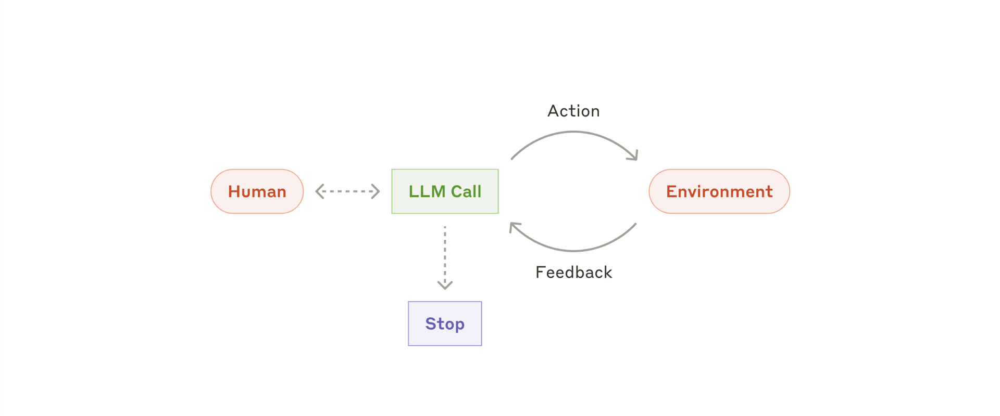

<!-- _class: lead -->
<!-- _paginate: false -->

# 第5-6课时｜大模型智能体架构
## ReAct · Reflexion · Plan-and-Execute · 工具调用（Tool Calling）

MBA《大模型智能体》

---

# 课程定位

- **主题**：让LLM从"会说"走向"会做"
- **对象**：产品经理、业务负责人、创业者
- **目标**：理解并能设计一个可落地的Agent系统
- **方式**：概念 + 框架 + 案例 + 动手

---

# 学习目标

完成本课后，你将能够：

1. 解释 **Agent 与 Workflow** 的本质区别
2. 画出 Agent 的核心架构（LLM/Memory/Tools/Planner）
3. 理解并复述 **ReAct、Reflexion、Plan-and-Execute**
4. 设计一个可执行的工具调用（Tool Calling）流程
5. 比较主流Agent产品并做选型

---

# 课程地图（90分钟）

| 模块 | 时间 | 产出 |
|---|---:|---|
| 1. Agent基础 | 15 min | 统一概念与边界 |
| 2. ReAct | 20 min | 理解循环式推理与行动 |
| 3. Reflexion & 新方法 | 15 min | 理解失败反思与前沿范式 |
| 4. Plan-and-Execute | 15 min | 掌握任务分解与重规划 |
| 5. 工具调用（Tool Calling） | 15 min | 设计可执行工具链 |
| 6. 产品对比 + 实战 | 10 min | 形成落地策略 |

---

# 先问一个问题

> "为什么同样是LLM，
> 有的产品只能回答问题，
> 有的却能自动帮你完成任务？"

核心差异：**控制流是否由LLM动态决定**。

---

<!-- _backgroundColor: #0f172a -->
<!-- _color: #f1f5f9 -->

# Part 1｜什么是Agent？
从定义到架构，建立统一认知

---

# 01｜什么是Agent？

## 两大权威定义

**OpenAI (2025)**：
> "Agents are systems that **independently accomplish tasks** on your behalf."
> ——强调 Workflow（确定性编排）→ Agent（自主决策）的**频谱**

**Anthropic (2024)**：
> 明确区分 **Workflow**（预定义代码路径编排LLM）vs **Agent**（模型自主决定工具使用和控制流程）

核心共识：Agent = LLM驱动决策 + 工具调用 + 自主纠错

<div class="tiny muted">来源: <a href="https://cdn.openai.com/business-guides-and-resources/a-practical-guide-to-building-agents.pdf">OpenAI - A Practical Guide to Building Agents (2025)</a> | <a href="https://www.anthropic.com/engineering/building-effective-agents">Anthropic - Building Effective Agents (2024)</a></div>

---

# Agent四大核心特征

| 核心特征 | 说明 |
|----------|------|
| **LLM驱动决策** | 用LLM管理工作流执行、做决策，识别何时完成 |
| **工具访问** | 动态选择合适工具与外部系统交互 |
| **自主纠错** | 识别错误并主动修正，必要时交还控制权 |
| **明确边界** | 在清晰定义的guardrails内运行 |



<div class="tiny muted">来源: <a href="https://cdn.openai.com/business-guides-and-resources/a-practical-guide-to-building-agents.pdf">OpenAI - A Practical Guide to Building Agents (2025)</a></div>

---

# 2026年：Agent已进入生产时代

| 指标 | 数据 | 来源 |
|------|------|------|
| Agent自主任务时长 | 从几分钟 → **14.5小时** | Anthropic Claude内部测试 |
| AI Agent引入后PR增长 | **+67%**/工程师 | Anthropic工程效率报告 |
| 开发者AI辅助比例 | **60%** 工作涉及AI | 行业调研 |
| Agent生产成熟度 | 从实验 → **大规模部署** | OpenAI/Anthropic/Google |

> 2024年还在讨论"Agent能不能用"，2026年已在讨论"怎么管理几百个Agent"。

---

# Agent三大基础组件


| 组件 | 作用 | 选择原则 |
|------|------|----------|
| **Model** | 推理引擎 | 先用最强模型建baseline，再降级优化成本 |
| **Tools** | 执行能力 | 数据工具/动作工具/编排工具 |
| **Instructions** | 行为约束 | 清晰、分解、明确动作、覆盖边缘 |

<div class="tiny muted">来源: <a href="https://cdn.openai.com/business-guides-and-resources/a-practical-guide-to-building-agents.pdf">OpenAI - A Practical Guide to Building Agents (2025)</a></div>

---

# Agent vs Workflow：频谱而非二选一

<div class="two-col">
<div class="card">

### Workflow（流程编排）
- 路径预先写死
- 规则驱动，可预测
- 易审计，适合标准化流程
- 例：按导航固定路线走

</div>
<div class="card">

### Agent（智能体）
- 路径运行时生成
- LLM自主决策，灵活
- 不确定但可探索
- 例：司机看路况动态改道

</div>
</div>

> 不确定性越高、信息越动态，Agent价值越大；规则越明确，Workflow更优。

---

# 何时该用Agent？

| 优先Agent | 仍用Workflow |
|-----------|-------------|
| 复杂决策（退款审批、风险评估） | 规则明确、流程稳定 |
| 规则难维护（供应商审核） | 需100%可审计 |
| 非结构化数据（保险理赔） | 不需要"智能判断" |

> 原则：**能用Workflow解决，就不要强上Agent**。

---

# Lilian Weng的Agent公式

```text
Agent = LLM + Memory + Planning + Tool Use
```

| 组件 | 子能力 | 经典技术 |
|------|--------|----------|
| **Planning** | 任务分解 + 反思改进 | CoT, ToT, Reflexion |
| **Memory** | 短期(上下文) + 长期(向量库) | In-context, MIPS |
| **Tool Use** | API调用 + 代码执行 | Function Calling |

> "LLM as the agent's brain" — Lilian Weng (OpenAI)

<div class="tiny muted">来源: <a href="https://lilianweng.github.io/posts/2023-06-23-agent/">Lilian Weng - LLM Powered Autonomous Agents (2023)</a></div>

---

# Agent系统架构图


<div class="tiny muted">来源: <a href="https://lilianweng.github.io/posts/2023-06-23-agent/">Lilian Weng - LLM Powered Autonomous Agents (2023)</a></div>

---

# Agent最小闭环与状态机

```text
用户目标 → LLM判断 → 调用工具 → 获取观察结果 → 更新状态
             ↑                                 ↓
             └───────── 未完成则继续循环 ─────────┘
```

| 状态 | 说明 | 常见失败 |
|---|---|---|
| Understand | 理解任务 | 目标歧义 |
| Plan | 生成步骤 | 计划过粗 |
| Act | 调用工具 | 参数错误 |
| Observe | 解析结果 | 误读返回 |
| Reflect | 自我修正 | 反思无效 |
| Finish | 输出结果 | 未满足验收 |

---

# 记忆与工具

<div class="two-col">
<div class="card">

### 记忆（不只是上下文）
- **短期**：当前会话上下文
- **长期**：用户偏好、历史任务
- **情景**：关键中间结果
- **经验**：失败原因与修复策略

</div>
<div class="card">

### 工具（让模型有手脚）
- 搜索（Web / 知识库）
- 计算（Python / SQL）
- 执行（邮件、CRM）
- 自动化（Browser / RPA）

</div>
</div>

> 没有记忆，Agent每次都像"失忆重来"；没有工具，Agent只是"空想家"。

---

# 规划与业务权衡

- 简单任务：边做边想（ReAct）
- 复杂任务：先分解再执行（Plan-and-Execute）
- 高复杂度：多路径搜索（ToT / GoT）

| 维度 | 高质量 | 低成本 | 低时延 |
|---|---|---|---|
| 更强模型 | ✅ | ❌ | ❌ |
| 更长链路 | ✅ | ❌ | ❌ |
| 更少步骤 | ❌ | ✅ | ✅ |

> 实际项目中，必须按业务目标做取舍。

---

# Anthropic: 5种Agentic系统模式

| 模式 | 核心思想 | 典型场景 |
|------|----------|----------|
| **Prompt Chaining** | 顺序步骤，上下游依赖 | 文档生成 → 翻译 |
| **Routing** | 分类输入，路由到专门处理 | 客服分流 |
| **Parallelization** | 同时执行独立子任务 | 多角度评估 |
| **Orchestrator-Workers** | 动态分解，协调Worker | 复杂代码修改 |
| **Evaluator-Optimizer** | 生成-评估-优化循环 | 文学翻译迭代 |

<div class="tiny muted">来源: <a href="https://www.anthropic.com/engineering/building-effective-agents">Anthropic - Building Effective Agents (2024)</a></div>

---

# 模式详解：Chaining / Routing / Parallel

<div class="three-col">
<div class="card">

**Chaining**
```text
输入→步骤1→步骤2→输出
```
固定子任务链

</div>
<div class="card">

**Routing**
```text
输入→分类→路径A/B/C
```
按类别选策略

</div>
<div class="card">

**Parallel**
```text
任务→A┐
    →B├→聚合
    →C┘
```
独立并行

</div>
</div>

---

# 模式详解：Orchestrator / Evaluator

<div class="two-col">
<div class="card">

### Orchestrator-Workers
```text
Orchestrator分析→动态分解
├→ Worker1 ├→ Worker2
← 汇总结果
```
子任务由Orchestrator**动态决定**

</div>
<div class="card">

### Evaluator-Optimizer
```text
生成→评估→反馈→改进
     (循环)
```
有明确评估标准时迭代优化

</div>
</div>

> **核心建议**："Success isn't about building the most sophisticated system. It's about building the **right system** for your needs." — Anthropic

---

# 动手试试 ①：判断是否该用Agent

<div class="try">

平台直达：[ChatGPT](https://chat.openai.com) ｜ [Kimi](https://kimi.moonshot.cn) ｜ [豆包](https://www.doubao.com)

任务：输入你的业务场景，让模型判断：
1) 用Workflow还是Agent？2) 理由是什么？

</div>

---

<!-- _backgroundColor: #0f172a -->
<!-- _color: #f1f5f9 -->

# Part 2｜ReAct：边推理边行动
思考-行动-观察的核心闭环

---

# 02｜ReAct：Synergizing Reasoning and Acting

**论文**：[arXiv:2210.03629](https://arxiv.org/abs/2210.03629) — Yao et al., 2023

核心思想：把"想"和"做"**交织**在同一条链路中。

```text
Thought: 我需要先确认最新数据来源
Action: search_web("2025 中国新能源汽车销量")
Observation: 乘联会数据显示...
Thought: 还需要竞品对比
Action: search_web("2025 比亚迪 特斯拉 中国销量")
Observation: ...
Final Answer: ...
```

---

# ReAct循环图

```text
Question
  ↓
Thought → Action → Observation
  ↑                     ↓
  └────── 是否完成？─────┘
            否：继续循环
            是：Final Answer
```


<div class="tiny muted">来源: <a href="https://lilianweng.github.io/posts/2023-06-23-agent/">Lilian Weng - LLM Powered Autonomous Agents</a> (引自ReAct论文)</div>

---

# ReAct为什么有效？

1. **减少幻觉**：用外部观察纠偏
2. **提升透明度**：每一步都有日志
3. **增强泛化**：面对未知任务能探索
4. **支持可插拔工具**：搜索、计算、执行

---

# LangChain版ReAct（示例）

```python
from langchain import hub
from langchain.agents import create_react_agent, AgentExecutor
from langchain_openai import ChatOpenAI
from langchain.tools import Tool

llm = ChatOpenAI(model="gpt-4o-mini", temperature=0)
prompt = hub.pull("hwchase17/react")

tools = [
    Tool(name="search", func=search_web, description="联网搜索"),
    Tool(name="python", func=run_python, description="执行Python代码"),
]

agent = create_react_agent(llm, tools, prompt)
executor = AgentExecutor(agent=agent, tools=tools, max_iterations=8)
print(executor.invoke({"input": "比较A公司与B公司估值"}))
```

---

# ReAct四类常见问题与优化

| 问题 | 典型表现 | 优化手段 |
|---|---|---|
| 伪观察 | 编造Observation | 强制Observation带来源 |
| 工具漂移 | 调错工具 | 设置工具调用预算 |
| 死循环 | 重复相似动作 | 循环检测 + `max_iterations` |
| 过度思考 | 太多Thought | 限制思考步数 |

> 关键配套：验证器（validator）+ 结构化输出

---

# ReAct + 结构化输出

```json
{
  "answer": "结论...",
  "evidence": ["url1", "url2"],
  "assumptions": ["假设1"],
  "next_actions": ["后续建议"]
}
```

结构化输出可直接进入下游系统，便于审计追踪。

---

# 动手试试 ②：手工模拟ReAct

<div class="try">

平台直达：[Kimi](https://kimi.moonshot.cn) ｜ [ChatGPT](https://chat.openai.com)

任务："分析2025年AI Agent创业机会，给出3个细分方向。"
要求模型按 `Thought/Action/Observation` 输出。

</div>

---

# 动手试试 ③：对比"有无ReAct"

<div class="try">

平台直达：[Claude](https://claude.ai) ｜ [Gemini](https://gemini.google.com)

同一问题各跑两次：1) 直接回答 2) 显式ReAct格式
观察：结论可靠性、证据数量、时延差异。

</div>

---

<!-- _backgroundColor: #0f172a -->
<!-- _color: #f1f5f9 -->

# Part 3｜Reflexion与前沿推理方法
从失败中学习 · 从规划到探索

---

# 03｜Reflexion：让Agent会复盘

**论文**：[arXiv:2303.11366](https://arxiv.org/abs/2303.11366) — Shinn & Labash, 2023

ReAct常见问题：失败后还犯同样错误。
**Reflexion解决**：失败后总结经验，下一轮强制参考。

---

# 反思方法谱系

| 方法 | 核心机制 | 论文 |
|---|---|---|
| **Self-Refine** | 自己批评自己，单次迭代 | [arXiv:2303.17651](https://arxiv.org/abs/2303.17651) |
| **Reflexion** | 失败→反思→记忆→下轮检索 | [arXiv:2303.11366](https://arxiv.org/abs/2303.11366) |
| **CRITIC** | 借助外部工具做验证 | [arXiv:2305.11738](https://arxiv.org/abs/2305.11738) |

---

# Reflexion架构

```text
Actor 执行任务
   ↓
Evaluator 评估成功/失败
   ↓(失败)
Self-Reflection 生成教训
   ↓
Memory Bank 写入经验
   ↓
下次执行前检索经验注入Prompt
```

"语言强化学习"：不更新参数，更新"策略文本"。
企业场景非常实用，成本远低于微调。

---

# Reflexion伪代码

```python
def solve_with_reflexion(task, memory_bank):
    hint = memory_bank.retrieve(task)
    result = actor(task, hint)
    score = evaluator(result)

    if score < 0.8:
        lesson = reflector(task, result, score)
        memory_bank.add(task, lesson)
        return solve_with_reflexion(task, memory_bank)

    return result
```

---

# 反思记忆设计

```json
{
  "task_type": "financial_analysis",
  "failure_pattern": "used outdated source",
  "lesson": "must cite source date <= 30 days",
  "trigger": ["market size", "forecast"],
  "created_at": "2026-02-27"
}
```

**设计建议**：只记录高价值失败 · lesson保持简短可执行 · 做过期机制 · 区分全局vs局部经验

---

# Reflexion的边界

<div class="warn">

- 反思质量依赖评估器质量
- 低质量lesson会"污染记忆库"
- 记忆过多稀释有效信息
- 错误归因不准会适得其反

</div>

---

# 前沿推理方法：超越ReAct

| 方法 | 核心思想 | 适用场景 | 论文 |
|------|----------|----------|------|
| **ReAct** | 思考-行动-观察闭环 | 通用探索型任务 | [2210.03629](https://arxiv.org/abs/2210.03629) |
| **Reflexion** | 失败→自我反思→纠错 | 需要从错误中学习 | [2303.11366](https://arxiv.org/abs/2303.11366) |
| **Plan-and-Solve** | 先规划后执行 | 长链多步任务 | [2305.04091](https://arxiv.org/abs/2305.04091) |
| **Tree-of-Thought** | 多路径探索+回溯 | 高复杂度推理 | [2305.10601](https://arxiv.org/abs/2305.10601) |

> ReAct仍是核心范式，但前沿方法在特定场景显著提升效果。

---

# Tree-of-Thought vs Graph-of-Thought

<div class="two-col">
<div class="card">

### Tree of Thoughts (ToT)
- 多分支生成候选思路
- 对分支打分并剪枝
- 类似搜索树，非单链推理
- [arXiv:2305.10601](https://arxiv.org/abs/2305.10601)

</div>
<div class="card">

### Graph of Thoughts (GoT)
- 想法节点组织成图
- 节点可复用、可合并
- 适合跨步骤引用
- [arXiv:2308.09687](https://arxiv.org/abs/2308.09687)

</div>
</div>

---

# 动手试试 ④：搭建轻量反思流

<div class="try">

平台直达：[Dify](https://dify.ai) ｜ [Coze](https://www.coze.com)

任务：创建一个"失败后自我总结"的工作流，
失败时把教训写入变量/知识库，再重试一次。

</div>

---

<!-- _backgroundColor: #0f172a -->
<!-- _color: #f1f5f9 -->

# Part 4｜Plan-and-Execute：先谋后动
复杂任务的分解、执行与重规划

---

# 04｜Plan-and-Execute

复杂任务中，仅靠ReAct逐步探索会很慢。

**Plan-and-Execute**：1) 先生成计划 → 2) 逐步执行 → 3) 根据结果重规划

**何时必须规划？**
- 任务链路长（>5步）
- 子任务有依赖关系
- 资源有限（预算/时延）
- 需要多Agent协同

---

# Plan-and-Execute标准架构

```text
User Goal
  ↓
Planner → 生成步骤清单
  ↓
Executor → 执行每个步骤
  ↓
Verifier → 检查是否达标
  ↓
Re-planner → 必要时改计划
```

---

# Planner & Executor Prompt

<div class="two-col">
<div class="card">

### Planner
```text
你是资深项目经理。
把目标拆成最小可执行步骤：
- step_id
- objective
- required_tool
- success_criteria
- dependency
```

</div>
<div class="card">

### Executor
```text
你是执行器，仅执行当前步骤。
输入：step内容+已完成结果
1) 只调用允许工具
2) 失败返回错误码+原因
3) 不得修改计划本身
```

</div>
</div>

---

# 重规划触发条件

| 触发器 | 示例 |
|---|---|
| 工具失败连续2次 | API超时/权限不足 |
| 关键假设被推翻 | 数据来源失效 |
| 预算超限 | token或调用费用过高 |
| 目标变化 | 用户中途追加约束 |

---

# ReAct vs Plan-and-Execute

| 维度 | ReAct | Plan-and-Execute |
|---|---|---|
| 上手难度 | 低 | 中 |
| 复杂任务能力 | 中 | 高 |
| 可控性 | 中 | 高 |
| 时延 | 低~中 | 中~高 |
| 审计性 | 中 | 高 |

---

# 企业项目中的规划模板

```yaml
goal: 生成行业分析报告
constraints:
  budget_usd: 2
  deadline_min: 8
steps:
  - collect_data
  - clean_data
  - compute_metrics
  - generate_slides
  - qa_check
```

---

# 动手试试 ⑤：搭一个Planner

<div class="try">

平台直达：[Flowise](https://flowiseai.com) ｜ [LangGraph Docs](https://langchain-ai.github.io/langgraph/)

任务：把"做一份竞品分析PPT"拆成至少6步，每步指定工具与成功标准。

</div>

---

<!-- _backgroundColor: #0f172a -->
<!-- _color: #f1f5f9 -->

# Part 5｜工具调用（Tool Calling）
从回答到执行，让Agent有"手脚"

---

# 05｜工具调用：核心协议

如何让LLM以"机器可执行"的方式调用外部能力？
答案：**函数调用 / 工具调用协议化**。

```json
{
  "tool": "search_news",
  "arguments": {
    "query": "AIGC政策 2026",
    "top_k": 5
  }
}
```

---

# OpenAI风格函数Schema

```json
{
  "name": "get_weather",
  "description": "查询城市天气",
  "parameters": {
    "type": "object",
    "properties": {
      "city": {"type": "string"},
      "unit": {"type": "string", "enum": ["c", "f"]}
    },
    "required": ["city"]
  }
}
```

**工具设计四原则**：单一职责 · 幂等可重试 · 参数显式 · 返回结构化

---

# 工具网关与错误处理

<div class="two-col">
<div class="card">

### 工具网关层
- 鉴权与配额
- 参数校验
- 重试与熔断
- 日志与审计
- 敏感操作二次确认

</div>
<div class="card">

### 错误处理策略
| 错误类型 | 处理 |
|---|---|
| 参数错误 | LLM重构参数 |
| 权限错误 | 人工授权 |
| 超时错误 | 指数退避重试 |
| 业务冲突 | 用户确认 |

</div>
</div>

---

# 可观测性与安全治理

**应记录**：每次Thought/Action/Observation · 工具耗时与成功率 · token消耗与成本 · 最终评分

<div class="warn">

**安全红线**：
- Prompt Injection 防护
- 敏感工具白名单
- 数据分级与脱敏
- 人工审批（HITL）
- 全链路可追溯

</div>


<div class="tiny muted">来源: <a href="https://cdn.openai.com/business-guides-and-resources/a-practical-guide-to-building-agents.pdf">OpenAI - A Practical Guide to Building Agents (2025)</a></div>

---

# 动手试试 ⑥：配置工具调用

<div class="try">

平台直达：[OpenAI Platform](https://platform.openai.com) ｜ [Anthropic Console](https://console.anthropic.com) ｜ [Google AI Studio](https://aistudio.google.com)

任务：定义一个 `get_stock_price(symbol, date)` 工具，让模型自动决定何时调用。

</div>

---

<!-- _backgroundColor: #0f172a -->
<!-- _color: #f1f5f9 -->

# Part 6｜多Agent编排模式
Manager模式 · 去中心化 · 编码Agent

---

# 多Agent编排：两种经典模式

<div class="two-col">
<div class="card">

### Manager模式（中心化）
- 一个Manager Agent调度多个Worker
- Manager决定任务分配和汇总
- 适合有明确层级的任务


</div>
<div class="card">

### 去中心化模式
- Agent之间直接通信/交接
- 没有单一控制点
- 适合对等协作场景


</div>
</div>

<div class="tiny muted">来源: <a href="https://cdn.openai.com/business-guides-and-resources/a-practical-guide-to-building-agents.pdf">OpenAI - A Practical Guide to Building Agents (2025)</a></div>

---

# 编码Agent：最成熟的Agent应用


| 维度 | 说明 |
|------|------|
| **工作流** | 接收任务→分析代码→生成修改→运行测试→提交 |
| **典型产品** | Cursor, GitHub Copilot, Codex CLI, Claude Code |
| **2026数据** | Anthropic内部67% PR增长/工程师 |
| **核心价值** | 重复性编码自动化，人类聚焦架构与创意 |

<div class="tiny muted">来源: <a href="https://cdn.openai.com/business-guides-and-resources/a-practical-guide-to-building-agents.pdf">OpenAI - A Practical Guide to Building Agents (2025)</a></div>

---

<!-- _backgroundColor: #0f172a -->
<!-- _color: #f1f5f9 -->

# Part 7｜产品对比与选型
现有平台能力横评 · 管理者决策框架

---

# 06｜产品全景（2026）

| 产品 | 定位 | 典型强项 |
|---|---|---|
| ChatGPT | 通用Agent平台 | 工具生态、代码执行 |
| Claude | 长上下文与推理 | 稳健输出、文档处理 |
| Gemini | Google生态协同 | 搜索与Workspace整合 |
| Kimi | 中文长文档 | 来源引用、检索体验 |
| 豆包 | 中文通用助手 | 国内用户规模 |

---

# ChatGPT / Claude / Gemini 对比

| 维度 | ChatGPT | Claude | Gemini |
|---|---|---|---|
| 工具调用 | 强 | 中 | 强 |
| 长文本 | 强 | 很强 | 强 |
| 编程 | 很强 | 强 | 强 |
| 生态整合 | 强 | 中 | 很强 |
| 企业治理 | 强 | 强 | 强 |

---

# Agent平台型产品对比

| 平台 | 形态 | 优势 | 链接 |
|---|---|---|---|
| Dify | 可视化 + API | 快速搭建企业应用 | [dify.ai](https://dify.ai) |
| Coze | Bot平台 | 社区生态、分发 | [coze.com](https://www.coze.com) |
| Flowise | 开源编排 | 私有部署友好 | [flowiseai.com](https://flowiseai.com) |
| LangGraph | 代码编排框架 | 状态机与可控性 | [LangGraph](https://langchain-ai.github.io/langgraph/) |

---

# 选型建议（给管理者）

1. **先验证价值**：用平台型产品快速MVP
2. **再优化成本**：替换高成本链路
3. **最后控风险**：补齐治理和审计

| 方案 | 优点 | 风险 |
|---|---|---|
| Buy（采购） | 快速上线 | 定制受限、数据边界 |
| Build（自研） | 深度可控 | 周期长、团队要求高 |
| Hybrid（混合） | 平衡速度与控制 | 架构复杂度上升 |

> 选型不是"谁最强"，而是"谁最适配你的组织能力"。

---

# 动手试试 ⑦：三平台压力测试

<div class="try">

平台直达：[ChatGPT](https://chat.openai.com) ｜ [Kimi](https://kimi.moonshot.cn) ｜ [Claude](https://claude.ai)

同题测试："输出中国智能硬件行业进入策略，含数据来源和风险清单。"
按：质量/速度/成本/可追溯性 打分。

</div>

---

<!-- _backgroundColor: #0f172a -->
<!-- _color: #f1f5f9 -->

# Part 8｜Agent系统评估 (Evals)
没有Eval就是盲飞

---

# Agent评估：为什么必须有？

> 📚 来源: [Anthropic - Demystifying Evals for AI Agents](https://www.anthropic.com/engineering/demystifying-evals-for-ai-agents)

- 没有Eval → 盲飞：只能靠抱怨后修复
- 有了Eval → 变化可见、回归可检、改进可量化

| 术语 | 定义 |
|------|------|
| **Task** | 单个测试用例，有明确输入和成功标准 |
| **Trial** | 对同一Task的一次执行尝试 |
| **Grader** | 评分逻辑，检查某个方面的表现 |
| **Eval Suite** | 多个Task组成的测试集 |

---

# 三类评分器 (Grader)

| 类型 | 方法 | 优势 | 劣势 |
|------|------|------|------|
| **Code-based** | 字符串匹配、单元测试 | 快速、确定、可复现 | 对变体不灵活 |
| **Model-based** | LLM评分、Rubric评估 | 灵活、能处理开放任务 | 非确定、需校准 |
| **Human** | 专家评审、A/B测试 | 金标准质量 | 贵、慢、难规模化 |

---

# 评估目标与关键指标

<div class="two-col">
<div class="card">

### 两种评估目标
- **Capability Eval**: Agent能做什么？（爬坡）
- **Regression Eval**: 还能做原来的事吗？（防退化）

Capability通过率高后 → 毕业成为Regression

</div>
<div class="card">

### pass@k vs pass^k
| 指标 | 含义 |
|------|------|
| **pass@k** | k次至少1次成功 |
| **pass^k** | k次全部成功 |

75%单次成功率，3次trial：
- pass@3 ≈ 98%
- pass^3 ≈ 42%

</div>
</div>

---

# Eval建设路线图

| 步骤 | 行动 | 目标 |
|------|------|------|
| **0. 尽早开始** | 20-50个真实失败case | 有比没有强 |
| **1. 手动→自动** | 上线前检查转自动化 | 覆盖已知场景 |
| **2. 明确规范** | 两个专家应得出相同判断 | 消除歧义 |
| **3. 平衡正负** | 测该做的+不该做的 | 避免过度优化 |
| **4. 隔离环境** | 每次从干净状态开始 | 消除干扰 |
| **5. 评结果非路径** | 允许创造性解法 | 避免过度约束 |
| **6. 读Transcript** | 理解失败原因 | 校准Grader |

> 就像TDD，但是针对AI Agent — **Eval-Driven Development**

---

# 动手试试 ⑧：设计你的Agent Eval

<div class="try">

为市场研究Agent设计评估方案，考虑：
1. 用什么Grader？(代码/模型/人工)
2. 如何定义成功标准？
3. 需要多少个Task？

```yaml
eval_suite: market_research_agent
tasks:
  - id: "task_1"
    input: "..."
    graders: [...]
    success_criteria: "..."
```

</div>

---

<!-- _backgroundColor: #0f172a -->
<!-- _color: #f1f5f9 -->

# Part 9｜综合案例与落地路线
从原型到生产的完整路径

---

# 07｜综合案例：市场研究Agent

**目标**：48小时内产出《某细分行业进入建议》

```text
User Query
  ↓
Planner（拆任务）
  ↓
Research Agent（搜索/抽取）
  ↓
Analysis Agent（计算/对比）
  ↓
Writer Agent（报告生成）
  ↓
Verifier（事实核查）
```

要求：至少10个外部来源 · 关键数据可追溯 · 有风险与反例

---

# 案例中的反思机制与KPI

**反思机制**：
- 若核查失败 → 记录失败模式
- lesson自动注入writer/verifier提示词
- 示例："市场规模必须注明年份与口径"

| 指标 | 目标 |
|---|---:|
| 首次通过率 | ≥ 70% |
| 平均完成时长 | ≤ 12 min |
| 引用可追溯率 | 100% |
| 单任务成本 | ≤ ¥8 |

---

# 实施路线图（30/60/90天）

| 阶段 | 目标 | 关键交付物 | 验收指标 |
|---|---|---|---|
| 30天 | 单场景MVP | 1个可运行Agent、基础日志 | 首次可用率 ≥ 60% |
| 60天 | 加入反思与评估 | Reflexion记忆库、评估集 | 首次通过率 ≥ 70% |
| 90天 | 多场景复用+治理 | RBAC权限、审计看板 | 可追溯率 100% |

<small>建议：每30天做一次"价值-风险-成本"复盘，再决定是否扩容。</small>

---

# 常见组织误区

<div class="warn">

1. 只追模型分数，不看业务闭环
2. 忽略数据与权限治理
3. 没有观测体系就盲目扩展
4. 把Agent当"万能员工"

</div>

---

# 课堂快问快答

1. ReAct中最关键的三个元素是什么？
2. Reflexion和Self-Refine最大的差异？
3. Plan-and-Execute在哪类任务优势最大？
4. 工具调用为什么必须结构化？

<!--
参考答案（授课者备注）：
1) Thought / Action / Observation（思考-行动-观察闭环）。
2) Reflexion强调"失败后写入记忆并在下一轮检索使用"；Self-Refine更偏单次迭代改写，不一定有持久记忆库。
3) 长链路、多依赖、强约束的复杂任务（如投研、合规审查、多步骤自动化）。
4) 结构化便于参数校验、自动执行、错误恢复、审计追踪，也是安全治理前提。
-->

---

# 本课总结（管理者视角）

| 层面 | 要点 |
|------|------|
| **战略层** | Agent提升组织执行自动化能力 |
| **战术层** | ReAct + Reflexion + Planning 构成核心方法论 |
| **工程层** | 工具调用 + 可观测 + 治理是上线关键 |
| **经营层** | 以ROI衡量，不以"炫技"衡量 |

---

# 课后作业（必做）

在你的业务中选择1个场景，提交：

1. Agent目标定义（输入/输出/成功标准）
2. 组件设计（LLM/Memory/Tools/Planner）
3. 风险清单（安全/合规/成本）
4. 2周POC计划

---

# 参考资料（必读）

## 核心论文
- [ReAct: Synergizing Reasoning and Acting](https://arxiv.org/abs/2210.03629) - Yao et al., 2023
- [Reflexion: Self-Reflection for Autonomous Agents](https://arxiv.org/abs/2303.11366) - Shinn & Labash, 2023
- [Plan-and-Solve Prompting](https://arxiv.org/abs/2305.04091) - Wang et al., 2023
- [Tree of Thoughts: Deliberate Problem Solving](https://arxiv.org/abs/2305.10601) - Yao et al., 2023

## 大公司官方指南 ⭐
- [OpenAI: A Practical Guide to Building Agents](https://cdn.openai.com/business-guides-and-resources/a-practical-guide-to-building-agents.pdf) - 32页实战手册
- [Anthropic: Building Effective Agents](https://www.anthropic.com/engineering/building-effective-agents) - 5大模式
- [Anthropic: Demystifying Evals for AI Agents](https://www.anthropic.com/engineering/demystifying-evals-for-ai-agents) - 评估体系

---

# 参考资料（续）

## 框架与架构
- [LangChain: Choosing the Right Multi-Agent Architecture](https://blog.langchain.com/choosing-the-right-multi-agent-architecture/)
- [LangGraph Docs](https://langchain-ai.github.io/langgraph/)
- [OpenAI Agents SDK](https://github.com/openai/openai-agents-python)
- [Microsoft AutoGen](https://www.microsoft.com/en-us/research/project/autogen/)
- [CrewAI](https://www.crewai.com/blog/build-your-first-crewai-agents)

## 技术博客
- [Lilian Weng: LLM Powered Autonomous Agents](https://lilianweng.github.io/posts/2023-06-23-agent/)
- [Chip Huyen: Building LLM Applications for Production](https://huyenchip.com/2023/04/11/llm-engineering.html)

## 视频
- [Andrej Karpathy: Intro to LLMs](https://youtube.com/watch?v=zjkBMFhNj_g) | [Deep Dive (3.5h)](https://www.youtube.com/watch?v=7xTGNNLPyMI)

---

# 下一讲预告

## 记忆系统与多工具编排实战

- 向量记忆 + 结构化记忆
- 多Agent协同
- 企业级上线清单

---

<!-- _class: lead -->
<!-- _backgroundColor: #5b3fd6 -->
<!-- _color: #ffffff -->

# Thank You
## 把"会聊天的大模型"变成"会交付的智能体"

Q&A
