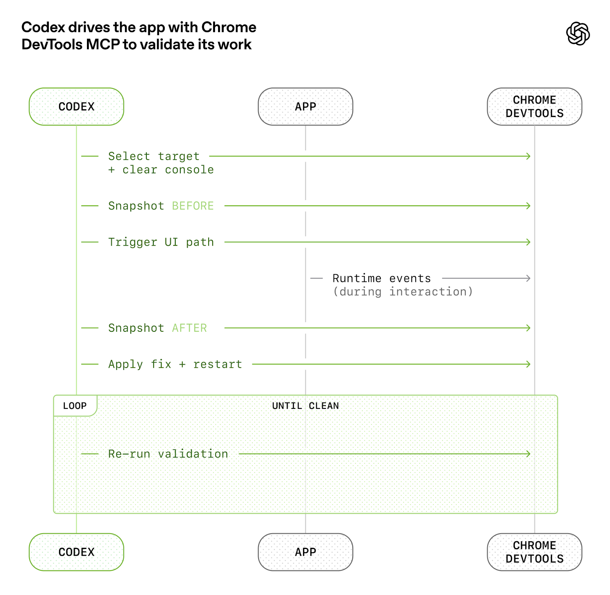
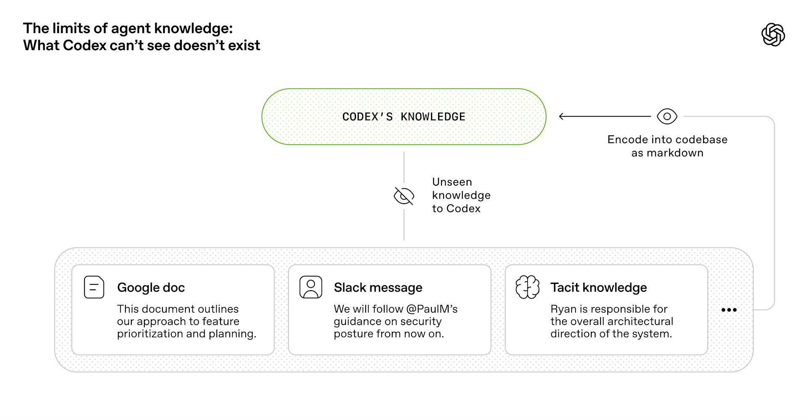
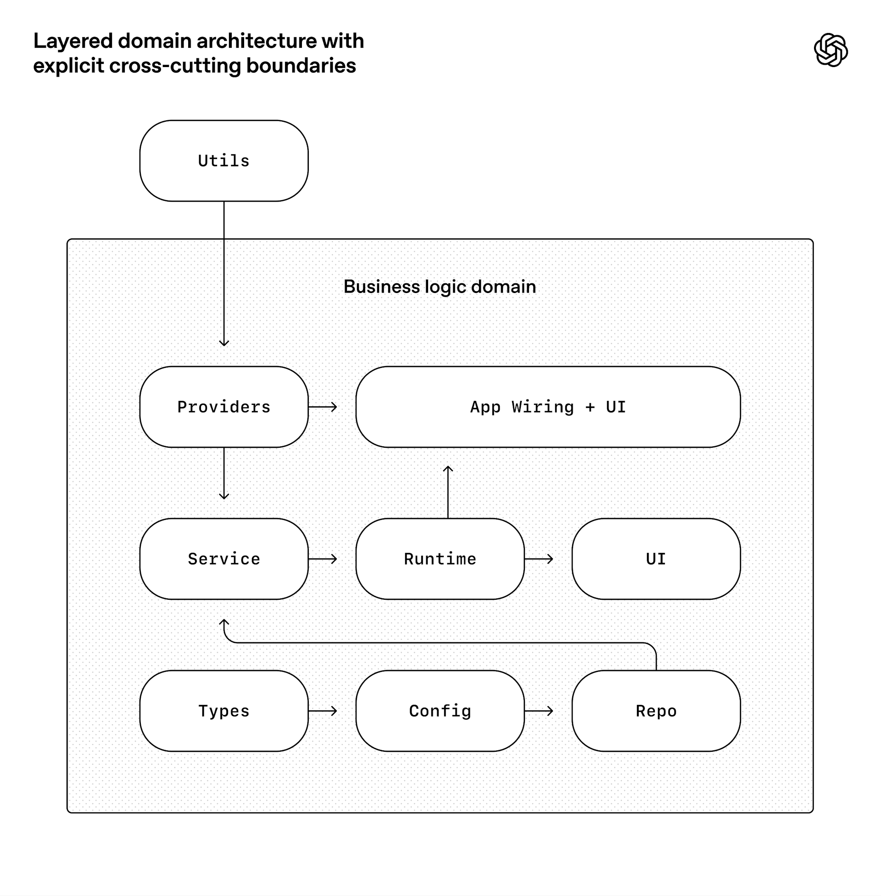
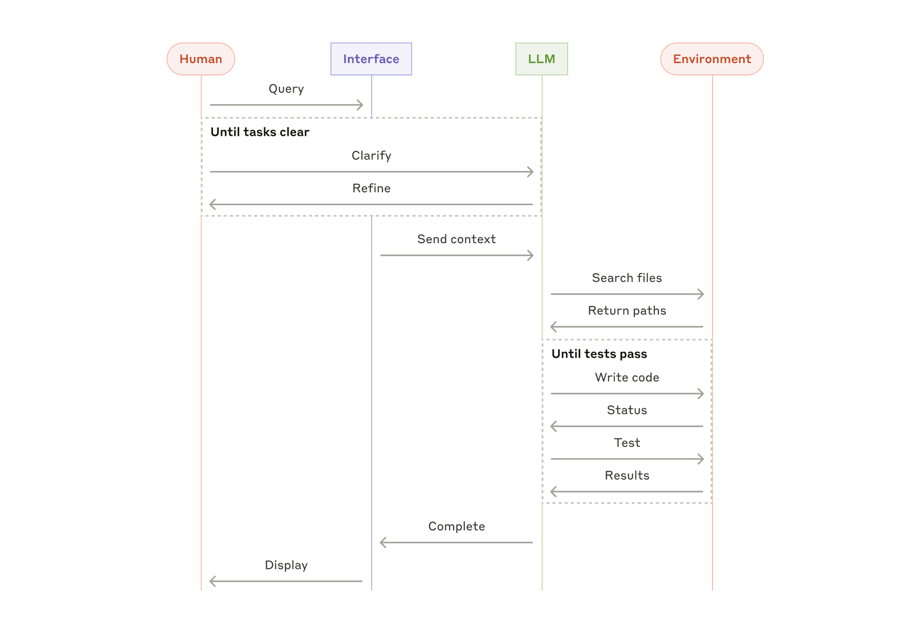
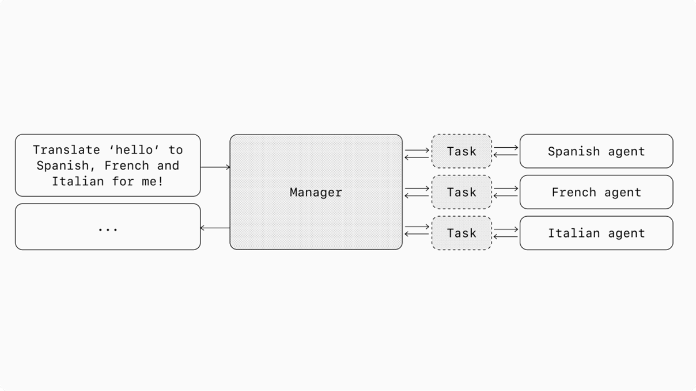

<!-- _paginate: false -->

# 第13-14课时｜LLM OS 与 Harness Engineering
## 从"聊天机器人"到"AI操作系统"的工程实践

<span class="tag">90分钟</span><span class="tag">讲授 + 演示 + 讨论</span><span class="tag">60页完整版</span>

**主线**：LLM OS概念 → Harness Engineering（2026最热话题）→ OpenClaw架构 → Agentic Coding趋势

<div class="tiny muted">2026年3月 · MBA大模型智能体课程</div>

---

# 课时目标（完成后你将能）

1. 解释 Karpathy 的 **LLM OS** 愿景及操作系统类比
2. 定义 **Harness Engineering**，理解 "Agent = Model + Harness"
3. 分析 OpenAI / Anthropic / LangChain 三大厂商的 Harness 实践
4. 评估 **Big Model vs Big Harness** 争论的商业含义
5. 画出 OpenClaw **六层架构**并解释数据流
6. 用 **Agentic Coding** 最新数据论证企业AI转型价值

---

# 课程地图

| Part | 内容 | 页数 | 时间 |
|------|------|------|------|
| **Part 1** | LLM OS 概念 | 4页 | 8分钟 |
| **Part 2** | Harness Engineering ⭐核心 | 20页 | 30分钟 |
| **Part 3** | OpenClaw 架构深入 | 14页 | 20分钟 |
| **Part 4** | Agentic Coding 趋势 | 8页 | 15分钟 |
| **Part 5** | 展望 + 总结 | 6页 | 12分钟 |

> ⭐ Part 2 是本课核心新增：Harness是2026年最热的Agent Engineering话题

---

<!-- _backgroundColor: "#0f172a" -->
<!-- _color: #f1f5f9 -->

# Part 1｜LLM OS 概念

### 从应用到系统的范式跃迁

---

# 计算范式演进

| 时代 | 范式 | 用户交互 | 核心瓶颈 |
|------|------|----------|----------|
| 1980s | **命令行** CLI | 记忆命令 + 参数 | 学习成本高 |
| 1990s | **图形界面** GUI | 点击 + 拖拽 | 受限于界面设计 |
| 2020s | **LLM 应用** | 自然语言对话 | 单一功能、无状态 |
| **2025+** | **LLM OS** | 自然语言 = 通用接口 | 统一管理所有能力 |

<br>

> **关键转变**：从"人学习使用软件" → "软件理解人的意图"

<div class="tiny muted">Andrej Karpathy, "Intro to LLMs", 2023</div>

---

# Karpathy 的 LLM OS 愿景

> "LLM 正在成为一种新的操作系统内核。
> 传统 OS 管理硬件资源，LLM OS 管理知识和能力。"

**这不是比喻，而是架构思想**：

- 🧠 LLM = CPU → 核心计算/推理引擎
- 📋 Context Window = RAM → 工作记忆（有限且昂贵）
- 💾 向量数据库/知识库 = 硬盘 → 长期存储
- ⚙️ Agent = 进程 → 执行单元
- 🔌 Tool Calling / MCP = 系统调用 → 能力扩展
- 🔐 安全边界 = 权限系统 → 访问控制
- 🗣️ 自然语言 = Shell / GUI → 用户接口

<div class="tiny muted">Karpathy, 2023 · 这张类比表贯穿全课</div>

---

# 为什么 OS 类比有价值？

### 1. 解释复杂系统
向 CEO 解释"Agent 记忆系统" → **"就像电脑的硬盘"**，比解释向量数据库容易 100 倍

### 2. 指导架构设计
操作系统几十年的设计智慧可以直接借鉴：分层抽象、资源管理、进程隔离、安全模型

### 3. 预测发展方向
传统 OS：单机 → 网络 → 分布式 → 云
LLM OS：单Agent → 多Agent → 分布式Agent网络 → Agent云

> **但 LLM OS 概念只是起点——真正的工程挑战是：如何构建围绕 LLM 的系统层？**
> 这就是 **Harness Engineering**

---

<!-- _backgroundColor: "#0f172a" -->
<!-- _color: #f1f5f9 -->

# Part 2｜Harness Engineering
### 2026年最热的 Agent Engineering 话题

---

# 什么是 Harness？

> **Agent = Model + Harness**
> — LangChain, "The Anatomy of an Agent Harness"

**Harness** = 围绕 Model 的一切代码、配置和执行逻辑

> *"If you're not the model, you're the harness."*

### 三个类比
| 类比 | Model | Harness |
|------|-------|---------|
| 🐎 赛马 vs 马具 | 马的力量 | 缰绳、鞍具、骑手指令 |
| 🖥️ CPU vs 主板 | 计算核心 | 内存、IO、电源管理 |
| ✈️ 飞行员 vs 驾驶舱 | 决策者 | 仪表、控制面、自动驾驶 |

<div class="tiny muted">LangChain Blog, 2026.02 · https://blog.langchain.com/the-anatomy-of-an-agent-harness/</div>

---

# Harness 包含什么？


```
┌─────────────────────────────────────────────────────────────┐
│                    Agent = Model + Harness                   │
├──────────────────────┬──────────────────────────────────────┤
│       Model          │              Harness                  │
│  ┌────────────────┐  │  ┌─────────────────────────────────┐ │
│  │ 推理 / 生成    │  │  │  System Prompts (身份+约束)     │ │
│  │ 理解 / 判断    │  │  │  Tools / Skills / MCP (能力)    │ │
│  │ 规划 / 编码    │  │  │  Sandbox (安全隔离执行)         │ │
│  └────────────────┘  │  │  Orchestration (编排逻辑)       │ │
│                      │  │  Memory & State (记忆+状态)     │ │
│                      │  │  Context Management (上下文)    │ │
│                      │  └─────────────────────────────────┘ │
└──────────────────────┴──────────────────────────────────────┘
```

**为什么突然成了热门话题？**
三大厂商在2026年初几乎同时发布 Harness 深度文章 →

---

# 三篇定义性文章（同期发布）

| 文章 | 发布方 | 核心观点 |
|------|--------|----------|
| [Harness Engineering](https://openai.com/index/harness-engineering/) | **OpenAI** | 0行手写代码，100万行Agent产出 |
| [Anatomy of an Agent Harness](https://blog.langchain.com/the-anatomy-of-an-agent-harness/) | **LangChain** | 系统拆解Harness六大核心组件 |
| [Effective Harnesses for Long-Running Agents](https://www.anthropic.com/engineering/effective-harnesses-for-long-running-agents) | **Anthropic** | 长时运行Agent的跨session状态管理 |

<br>

> Latent Space: "**Harness Engineering** 已成为 Agent Engineering 的关键子领域"

<div class="tiny muted">Latent Space, "Is Harness Engineering Real?", 2026.02</div>

---

<!-- _backgroundColor: "#1e293b" -->
<!-- _color: #f1f5f9 -->

# 2.2 Harness 的核心组件
### LangChain 的系统分析

---

# 组件 1：文件系统

> *"Arguably the most foundational harness primitive"*
> — LangChain

**文件系统 = Agent 的持久化层**

- 跨 session 状态保存（不随 context window 消失）
- 协作表面：多 Agent 通过文件交换信息
- 计划 + 进度 + 产出全部写入文件

### 实际应用
```
workspace/
├── AGENTS.md        # Agent 行为指南（目录，非百科）
├── progress.txt     # 当前进度
├── feature_list.json # 任务清单
└── docs/            # 详细文档（按需加载）
```

<div class="tiny muted">LangChain Blog · Harness Component: Filesystem</div>

---

# 组件 2-3：Bash/代码执行 + 沙箱

### Bash + 代码执行
- Agent 自己写代码解决问题 → 不再局限于预定义 tool set
- **通用工具**：一个 `exec` 工具 = 无限能力

### 沙箱 (Sandbox)
- 安全隔离的执行环境
- 按需创建 → fan-out 并行 → 完成后销毁
- Docker / VM / 沙箱进程

```
用户请求 → Agent 生成代码 → 沙箱执行 → 返回结果
                                ↑
                    与主系统隔离，安全可控
```

> **关键**：给 Agent 代码执行能力，同时用沙箱约束风险

---

# 组件 4：记忆与搜索

### AGENTS.md = Continual Learning 机制
- 不是一次性写好的文档
- 随着 Agent 工作不断更新
- "从经验中学习"的物化形式

### Web Search = 补充知识截止日期之后的信息
- Agent 不知道的东西 → 搜索获取
- 搜索结果写入文件 → 跨 session 复用

### 记忆金字塔
| 层级 | 类型 | 时效 | 例子 |
|------|------|------|------|
| L1 | Context Window | 当前对话 | 正在讨论的内容 |
| L2 | 文件系统 | 持久 | MEMORY.md, progress.txt |
| L3 | 向量数据库 | 持久 + 可检索 | 历史经验、文档知识 |

---

# 组件 5：Context Rot 对抗

**Context Rot** = 长时运行中 context 被过时/无关信息填满，导致性能下降

### 三种对抗策略

| 策略 | 做法 | 类比 |
|------|------|------|
| **Compaction** | 压缩 + 摘要，防止溢出 | 内存碎片整理 |
| **Tool Call Offloading** | 大输出转存文件系统 | 虚拟内存 swap |
| **Progressive Disclosure** | 按需加载能力/文档 | 动态链接库 |

> **AGENTS.md 应该是目录（~100行），不是百科全书（数千行）**
> 先给地图，需要时再深入

---

# 组件 6：Ralph Loop（长时运行支持）

### 问题：Agent 以为自己完成了——但其实没有

```python
# Ralph Loop 伪代码
while not task_complete:
    result = agent.run(task, context_window=fresh)
    
    if agent.wants_to_exit():
        # 🚫 拦截退出！
        progress = read_progress_file()
        # 在新的 context window 中继续
        agent.run(original_task, 
                  context=f"Previous progress: {progress}. Continue.")
```

> 名字来源：《辛普森一家》Ralph Wiggum 的 "I'm in danger" meme
> Agent 以为自己做完了，Harness 说："不，继续。"

<!-- 建议插图：Ralph Wiggum "I'm in danger" meme -->

<div class="tiny muted">LangChain · "Ralph Loop" pattern</div>

---

<!-- _backgroundColor: "#1e293b" -->
<!-- _color: #f1f5f9 -->

# 2.3 OpenAI 实验：0行手写代码


### 迄今最激进的 Harness Engineering 实践

<div class="tiny muted">Source: https://openai.com/index/harness-engineering/</div>

---

# 实验设置与震撼数据

| 指标 | 数据 |
|------|------|
| 时间跨度 | **5 个月** |
| 工程团队 | **3 人**（后增至 7 人） |
| 手写代码 | **0 行** |
| Agent 产出 | **~1,000,000 行代码** |
| PR 数量 | **~1,500 个** |
| 平均吞吐 | **3.5 PR / 工程师 / 天** |
| 单次最长运行 | **6 小时**（人在睡觉） |

> 所有代码由 Codex Agent 生成，工程师**一行都没写**

---

# 核心洞察 ①："人类掌舵，Agent执行"

> *"Humans steer. Agents execute."*

工程师的工作不再是写代码，而是：

| 传统工程师 | Harness 时代工程师 |
|------------|-------------------|
| 写代码 | 设计环境 |
| 调试 bug | 表达意图 (specification) |
| Code review | 构建反馈循环 |
| 手动测试 | 编写验收标准 |

> **类比**：从"自己开车" → "设计自动驾驶系统"

---

# 核心洞察 ②：AGENTS.md 是目录，不是百科

```
❌ 错误做法: 巨大的 AGENTS.md（数千行指令）
   → Context 是稀缺资源，巨型指令挤占任务空间
   → 太多"重要"的规则 = 没有重要的规则
   → 维护成本高，很快过时

✅ 正确做法: AGENTS.md 只是 ~100 行的"目录"
   → 指向 docs/ 目录中的详细文档
   → Progressive disclosure: 先给地图，需要时深入
   → 机械化执行: linter 检查文档是否过时
```

> **关键原则**：Agent 的注意力和人一样是稀缺资源

---

# 核心洞察 ③④：仓库知识 + Agent 可读性

### ③ "Repository knowledge is the system of record"

> *"Anything the agent can't access in-context while running effectively doesn't exist."*

Slack讨论、Google Docs、人脑中的知识——**如果不在 repo 里，对 agent 来说就不存在**



### ④ Agent Legibility > 人类审美偏好

- 代码首先为 **agent 的可读性** 优化
- 架构强制执行：custom linters + structural tests


- 不允许"human-only" 的隐性约定

> *"The resulting code does not always match human stylistic preferences, and that's okay."*

<div class="tiny muted">OpenAI Harness Engineering Blog, 2026</div>

---

<!-- _backgroundColor: "#1e293b" -->
<!-- _color: #f1f5f9 -->

# 2.4 Anthropic：长时运行 Agent 方案
### 核心挑战：如何跨 context window 持续进展？

<div class="tiny muted">Source: https://www.anthropic.com/engineering/effective-harnesses-for-long-running-agents</div>

---

# 两段式架构



```
Phase 1: Initializer Agent（仅第一次运行）
  → 创建 init.sh（启动脚本）
  → 创建 claude-progress.txt（进度文件）
  → 创建 feature_list.json（功能清单，全标 "failing"）
  → 初始 git commit

Phase 2: Coding Agent（每次后续运行）
  → 读取 progress + git log → 了解当前状态
  → 从 feature list 选 1 个未完成的 feature
  → 实现 → 测试 → commit → 更新 progress
  → 重复
```

**三件套**：`claude-progress.txt` + `feature_list.json` + `git commit`

---

# 关键设计决策

| 问题 | 解决方案 |
|------|----------|
| Agent 试图一次做太多 | 强制每次**只做 1 个 feature** |
| Agent 声称已完成（但没有） | `feature_list.json` 用 **JSON 格式** |
| Agent 不测试就标记完成 | 要求用 **Puppeteer MCP** 做 E2E 测试 |
| 新 session 不知道之前做了什么 | **git log + progress.txt + init.sh** |

### 为什么 JSON 而不是 Markdown？

> **JSON 比 Markdown 更不容易被 agent 篡改**
> — Markdown 的非结构化特性让 agent 容易"创造性编辑"
> — JSON 有严格格式，改了就 parse error

<div class="tiny muted">Anthropic Engineering Blog, 2026.02</div>

---

<!-- _backgroundColor: "#1e293b" -->
<!-- _color: #f1f5f9 -->

# 2.5 Big Model vs Big Harness
### 2026年 AI 工程界最核心的争论

---

# Big Model 派（模型为王）

### 核心论点：模型越强，harness 越不需要

| 代表人物 | 观点 |
|----------|------|
| **Claude Code 团队** | "All the secret sauce is in the model. This is the thinnest possible wrapper." |
| **Noam Brown** (OpenAI) | "People are building scaffolding… but those scaffolds will just be replaced by models becoming more capable." |

### 数据支持
- **METR 评测**：Claude Code 和 Codex 在某些任务上 ≈ 基础 scaffold
- **Scale AI SWE-Atlas**：harness 差异在误差范围内？

---

# Big Harness 派（Harness 为王）

### 核心论点：Harness 决定 Agent 能力上限

| 代表人物/实验 | 观点 |
|---------------|------|
| **Jerry Liu** (LlamaIndex) | "The Model Harness is Everything — the biggest barrier to getting value from AI is your own ability to context and workflow engineer." |
| **Terminal Bench 2.0** | 仅改变 harness，**15 个 LLM 的编码能力全部提升** |
| **Pi agent** | 仅优化 harness → 从 **#30 升至 #5** |

### 数据支持
- NxCode 2026: "2025是agent证明能写代码的年，**2026是我们发现harness才是难点的年**"
- Harness报告(PR Newswire): AI编码加速但 **DevOps 成熟度跟不上**

---

# 判断：真相在中间，但偏向 Harness 侧

```
┌──────────────────────────────────────────────────────────┐
│                                                          │
│  当前: Model + Harness 都重要                            │
│                                                          │
│  短期趋势: Harness 价值在增长                            │
│  → 模型能力快速商品化，差异化在 harness                  │
│                                                          │
│  长期趋势: Model 可能吞噬部分 Harness 功能              │
│  → 推理模型内置之前需要 scaffold 的能力                  │
│  → 但系统层需求（安全、审计、持久化）永远需要 harness   │
│                                                          │
│  类比: 发动机 vs 汽车                                    │
│  → 发动机越来越强，但你永远需要底盘、方向盘和安全带     │
│                                                          │
└──────────────────────────────────────────────────────────┘
```

---

# MBA 洞察：Harness 层的商业机会更大

### 如果 Big Model 赢 → 价值集中在 OpenAI / Anthropic / Google
### 如果 Big Harness 赢 → Harness 层公司持续创造价值

| 维度 | Model 层 | Harness 层 |
|------|----------|------------|
| 玩家数量 | **3-5 家**（资本壁垒极高） | **数百家**（差异化空间大） |
| 代表估值 | OpenAI ~$300B | **Cursor $50B** |
| 竞争壁垒 | 算力 + 数据 + 人才 | 工程 + 产品 + 生态 |
| MBA 机会 | 几乎为零 | **大量创业/投资机会** |

> **Cursor 只做了一个 "harness"（编辑器+agent），估值就到 $50B**
> 这说明 Harness 层的价值创造空间是巨大的

---

# Harness Engineering 小结

| 主题 | 关键 Takeaway |
|------|--------------|
| **定义** | Agent = Model + Harness |
| **LangChain 六组件** | 文件系统、Bash/沙箱、记忆、Context Rot对抗、Ralph Loop |
| **OpenAI 实验** | 0行手写代码 → 3人/5月/100万行/1500 PR |
| **Anthropic 方案** | 两段式 + 三件套 + JSON > Markdown |
| **争论判断** | 短期 Harness 价值增长，长期模型吞噬部分，系统层永远需要 |
| **MBA 洞察** | Model 层只有几家能玩，Harness 层差异化空间更大 |

---

<!-- _backgroundColor: "#0f172a" -->
<!-- _color: #f1f5f9 -->

# Part 3｜OpenClaw 架构深入
### 一个完整的 Agent Harness 实现

---

# OpenClaw = AI-Native Personal Operating System

**一句话定义**：让 AI Agent 像使用操作系统一样，统一管理你的工具、记忆、通信和任务

### 最新生态数据（2026.03）

| 指标 | 数据 | 对比 |
|------|------|------|
| **GitHub Stars** | **250,000+** | 超过 React |
| **ClawHub Skills** | **2,857+** | 6个月前不到 1,000 |
| **多渠道** | 飞书 / Telegram / WhatsApp / Discord / CLI | — |
| **部署方式** | 自托管 / 开源 | 数据完全在用户手中 |

<div class="tiny muted">Sources: finance.yahoo.com (250K stars) · xcloud.host (ClawHub 2,857+ skills)</div>

---

# 六层架构总览

```
┌──────────────────────────────────────────────────────┐
│  Layer 6: Channel Layer（接入层）                     │
│  └── 飞书 / Telegram / WhatsApp / Discord / CLI      │
├──────────────────────────────────────────────────────┤
│  Layer 5: Gateway（网关层）                           │
│  └── 消息路由、会话管理、认证授权                     │
├──────────────────────────────────────────────────────┤
│  Layer 4: Session Layer（会话层）                     │
│  └── 会话状态、上下文管理、对话连续性                 │
├──────────────────────────────────────────────────────┤
│  Layer 3: Agent Layer（智能体层）                     │
│  └── CEO Agent、子Agent、Multi-Agent协调             │
├──────────────────────────────────────────────────────┤
│  Layer 2: Capability Layer（能力层）                  │
│  └── Tools / MCP Servers / Skills / ClawHub          │
├──────────────────────────────────────────────────────┤
│  Layer 1: Node Network（节点网络）                    │
│  └── 本地设备、远程节点、IoT设备                     │
└──────────────────────────────────────────────────────┘
```

---

# Layer 6: Channel Layer（接入层）

**核心设计**：无论从哪个渠道发消息，Agent 看到的是统一接口

| 渠道 | 接入方式 | 适用场景 |
|------|----------|----------|
| 飞书 | 企业应用 | 企业办公（中国市场首选） |
| Telegram | Bot Token | 个人使用、海外用户 |
| WhatsApp | 扫码连接 | 全球用户覆盖 |
| Discord | Bot 配置 | 社区和团队协作 |
| CLI | 命令行 | 开发者、自动化 |

> **类比 OS**：Channel = 输入设备（键盘、触屏、语音）
> 不同设备 → 统一的系统调用

---

# Layer 5-4: Gateway + Session

### Gateway（网关层）
- 消息路由：把消息送到正确的 Session
- 认证授权：谁能访问哪些 Agent
- 负载均衡：多 Agent 场景的调度

### Session Layer（会话层）
- 维护对话历史和上下文
- 管理会话状态（活跃/暂停/结束）
- **Context Engine**：compaction + pruning + continuation

> **类比 OS**：Gateway = 网络栈 · Session = 进程上下文

---

# Layer 3: Agent Layer（智能体层）




### CEO 模式：主 Agent 调度子 Agent

```
用户请求 → CEO Agent（理解意图 → 分解任务）
                │
                ├── sessions_spawn("researcher", "分析这篇论文")
                ├── sessions_spawn("coder", "实现这个功能")
                └── sessions_spawn("analyst", "做市场分析")
                        │
                        ▼
                汇总结果 → 回复用户
```

> **类比 OS**：CEO Agent = 调度器 · 子 Agent = 工作进程

---

# Layer 2: Capability Layer（能力层）

### 三种能力来源

| 类型 | 说明 | 例子 |
|------|------|------|
| **内置 Tools** | 系统原生能力 | read, write, exec, web_search |
| **MCP Servers** | 标准化外部服务 | GitHub, Slack, 数据库 |
| **Skills** | 可安装的能力扩展 | arxiv, weather, imsg, 1password |

### ClawHub Skill 生态爆发

- **2,857+ Skills**（2026.03）
- 6个月前不到 1,000 → **3x 增长**
- 企业集成：Aurora Mobile (EngageLab) 发布 OpenClaw Skill

<div class="tiny muted">xcloud.host · manilatimes.net (EngageLab)</div>

---

# Layer 1: Node Network（节点网络）

**连接物理世界**：本地电脑、远程服务器、IoT 设备

```
CEO Agent (MacBook)
    │
    ├── exec("python train.py")  ← 本地节点
    ├── node: gpu-server          ← 远程 GPU 节点
    ├── node: raspberry-pi        ← IoT 节点
    └── camsnap: rtsp://camera    ← 摄像头节点
```

> **类比 OS**：Node Network = 设备驱动 + 外设管理
> Agent 可以跨设备执行任务

---

# Workspace 设计哲学：文件即配置

```
~/.openclaw/workspace/
├── SOUL.md          # 人格定义：我是谁？行为准则
├── USER.md          # 用户画像：用户是谁？偏好
├── MEMORY.md        # 长期记忆：跨 session 持久
├── TOOLS.md         # 工具使用笔记
├── HEARTBEAT.md     # 定时任务配置（cron）
├── AGENTS.md        # 多 Agent 团队配置
├── memory/          # 日志记忆
├── skills/          # 自定义 Skill
└── projects/        # 项目文件
```

| 设计原则 | 好处 |
|----------|------|
| 文件即配置 | 无需复杂后台，git 版本控制 |
| 透明可审计 | 所有状态人类可读 |
| 易于备份 | 整个目录 = 完整状态 |

---

# OpenClaw = 一个完整的 Agent Harness

将 LangChain 的 Harness 组件模型直接映射到 OpenClaw：

| Harness 组件 | OpenClaw 实现 |
|-------------|---------------|
| **Filesystem** | Workspace (SOUL.md, USER.md, MEMORY.md, projects/) |
| **Bash + Code** | `exec` 工具，支持 PTY |
| **Sandbox** | 子 Agent 隔离执行，sandbox 选项 |
| **Memory** | MEMORY.md + memory/*.md + 向量索引 |
| **Context Rot 对抗** | ContextEngine (compaction + pruning + continuation) |
| **Skills** | ~/.openclaw/workspace/skills/ + ClawHub 市场 |
| **长时运行** | HEARTBEAT.md (cron) + Ralph Loop |
| **多 Agent** | sessions_spawn + subagents |

---

# 核心哲学：受限空间内的最大自主

```
┌──────────────────────────────────────────────────────┐
│                                                      │
│  🔒 受限空间 (Bounded Space):                        │
│  ├── 安全策略：groupPolicy, allowlist, elevated审批  │
│  ├── 工具限制：可配置的 tool availability            │
│  └── 操作限制：安全边界，高风险操作需确认            │
│                                                      │
│  ↕ 在边界内 ↕                                        │
│                                                      │
│  🚀 最大自主 (Maximum Autonomy):                     │
│  ├── 丰富 context: USER.md, SOUL.md 完整画像        │
│  ├── 更多权限: exec, web, browser, node network     │
│  ├── 更强自主: spawn 子 agent, 安排 cron 任务       │
│  └── 长期记忆: 跨 session 状态持久化                │
│                                                      │
│  "Trust but verify" — 信任但验证                     │
│                                                      │
└──────────────────────────────────────────────────────┘
```

---

# 安全更新（2026.2.23）

| 更新项 | 内容 | 意义 |
|--------|------|------|
| **SSRF 防护** | 默认 `trusted-network` 模式 | 防止 Agent 访问内网敏感服务 |
| **Skill 打包** | 拒绝 symlink 逃逸 | 防止恶意 Skill 读取系统文件 |
| **权限审计** | Skill 安装时权限声明 | 用户知晓 Skill 需要什么权限 |

> **Agent Skill 市场本质是分布式代码执行平台**
> 安全治理是生态成功的前提——类比 App Store 审核机制

<div class="tiny muted">cybersecuritynews.com · OpenClaw v2026.2.23 Security Update</div>

---

# OpenClaw vs 竞品

| 维度 | OpenClaw | Claude Desktop | Cursor | Manus |
|------|----------|----------------|--------|-------|
| **定位** | 完整 Agent OS | 桌面对话应用 | AI 代码编辑器 | 通用 Agent |
| **多 Agent** | ✅ 原生 | ❌ 单 Agent | ❌ | △ |
| **多渠道** | ✅ 5+ 渠道 | ❌ 仅桌面 | ❌ 仅编辑器 | ❌ 仅 Web |
| **自定义人格** | ✅ SOUL.md | ❌ | ❌ | ❌ |
| **Skill 生态** | ✅ 2,857+ | ❌ | △ 扩展 | ❌ |
| **自托管** | ✅ | ❌ | ❌ | ❌ |
| **开源** | ✅ | ❌ | ❌ | ❌ (被Meta收购) |

> **关键差异**：OpenClaw 是唯一同时具备 多Agent + 多渠道 + 自托管 + 开源 + Skill生态 的方案

---

<!-- _backgroundColor: "#0f172a" -->
<!-- _color: #f1f5f9 -->

# Part 4｜Agentic Coding 趋势
### Anthropic 2026 Agentic Coding Trends Report

---

# 行业全景数据

| 指标 | 数据 | 含义 |
|------|------|------|
| 开发者 AI 使用率 | **~60%** 的工作涉及 AI | AI 已是主流工具 |
| 可完全委托的任务 | 仅 **0-20%** | 协作 ≠ 自动化 |
| SDLC 周期压缩 | 从 **周/月** → **小时/天** | 开发速度质变 |
| 额外产出 | **27%** 是"没AI就不会做的" | 不只是加速，是扩展 |

<br>

> **核心发现**：AI 不只让现有工作变快，更创造了新的可能性

<div class="tiny muted">Anthropic, "2026 Agentic Coding Trends Report"</div>

---

# 企业案例

### TELUS（加拿大电信巨头）
- 代码速度 **+30%**
- 节省 **500,000+ 工时**

### Zapier（自动化平台）
- 全公司 AI 采纳率 **89%**
- 部署 **800+ Agent**

### Anthropic 内部
- 每个工程师 PR 增长 **67%**

> **不是实验性数字——是大型企业的真实产出数据**

---

# Agent 自主任务时长：从分钟到小时

| 阶段 | 自主时长 | Agent 能力 |
|------|----------|-----------|
| 2023 | **秒级** | 单次 API 调用 |
| 2024 | **分钟级** | 多步 tool calling |
| 2025 | **小时级** | 自主 coding + testing |
| **2026** | **14.5 小时** | 端到端项目交付 |

> OpenAI 实验中最长单次运行 **6 小时**（人在睡觉，Agent 在工作）

### 意味着什么？
- Agent 可以接手**过夜任务**
- "周五下班前提需求，周一早上收 PR"
- 从"助手"到"同事"的质变

---

# 工程师角色：Implementer → Orchestrator

| 传统工程师 | Agent 时代工程师 |
|------------|-----------------|
| 写代码 | **任务分解** (task decomposition) |
| 调试 | **Agent 协调** (agent coordination) |
| Code review | **质量评估** (quality evaluation) |
| 手动测试 | **问题定义** (problem framing) |

<br>

> 回忆 OpenAI 的实验：3人团队，0行手写代码
> **工程师不再写代码——他们设计让 Agent 写出好代码的系统**

### 这就是 Harness Engineering 的人才需求

---

# Agentic Coding 的局限与挑战

### 不要过度乐观
- **0-20%** 的任务可完全委托 → 大部分仍需人类参与
- AI 加速编码，但 **DevOps 成熟度跟不上** (PR Newswire)
- 安全审查、架构决策、需求理解仍是人类的领域

### 信任但验证
- Agent 生成的代码需要 review
- 自动化测试是必须的安全网
- **架构强制执行** > 口头约定

> NxCode 2026: "2025是agent证明能写代码的年，2026是我们发现 harness 才是难点的年"

<div class="tiny muted">PR Newswire · NxCode · Anthropic 2026 Report</div>

---

<!-- _backgroundColor: "#0f172a" -->
<!-- _color: #f1f5f9 -->

# Part 5｜展望与总结

---

# LLM OS 发展方向

| 时间线 | 方向 | 关键变化 |
|--------|------|----------|
| **短期** (1-2年) | Harness 成熟化 | Skill 生态爆发、安全治理完善、Agent 可靠性提升 |
| **中期** (3-5年) | 具身智能集成 | Agent 控制机器人、多模态原生、物理世界交互 |
| **长期** (5-10年) | 分布式 Agent 网络 | Agent 之间协作、Agent 经济体、去中心化 |

---

# 具身智能：LLM OS 的下一个前沿

### Agent 不再只是操控软件——还将操控物理世界

```
LLM OS（软件层）
    │
    ├── 软件 Agent: 写代码、搜索、分析
    │
    └── 具身 Agent: 控制机器人、自动驾驶、工业自动化
         │
         ├── Figure AI: 人形机器人 + LLM 大脑
         ├── Physical Intelligence: 通用机器人策略
         └── 1X Technologies: NEO 人形机器人
```

> **Harness 的概念在具身智能中更加重要**
> 机器人的 Harness = 传感器融合 + 安全约束 + 物理模拟 + 实时控制

---

# 核心概念回顾

| # | 概念 | 一句话 |
|---|------|--------|
| 1 | **LLM OS** | AI 作为操作系统内核，管理知识和能力 |
| 2 | **Agent = Model + Harness** | Harness 是围绕模型的一切系统 |
| 3 | **Harness 六组件** | 文件系统、执行环境、沙箱、记忆、Context管理、长时运行 |
| 4 | **OpenAI 0代码实验** | 人类掌舵，Agent执行——3人/5月/100万行 |
| 5 | **Anthropic 方案** | 两段式 + 三件套，JSON > Markdown |
| 6 | **Big Model vs Big Harness** | 短期 Harness 价值增长，Cursor $50B 说明一切 |
| 7 | **OpenClaw 六层架构** | Channel → Gateway → Session → Agent → Capability → Node |
| 8 | **受限空间内最大自主** | Trust but verify |

---

# MBA 核心洞察

### 1. 价值链定位
Model 层只有 3-5 家能玩（资本壁垒）→ Harness 层差异化空间更大

### 2. Cursor $50B 的启示
一个"编辑器 + Agent harness" = $50B → Harness 层的价值创造是真实的

### 3. 人才需求转变
工程师从 Implementer → Orchestrator → **Harness Engineer**

### 4. 企业采纳路径
先 Agentic Coding（见效最快）→ 再 Agentic Operations → 最后 Full Agent OS

### 5. 安全是生态基石
Agent Skill 市场 = 分布式代码执行平台 → 没有安全治理就没有生态

---

# 延伸阅读

### Harness Engineering（必读）
- [OpenAI: Harness Engineering](https://openai.com/index/harness-engineering/)
- [LangChain: The Anatomy of an Agent Harness](https://blog.langchain.com/the-anatomy-of-an-agent-harness/)
- [Anthropic: Effective Harnesses for Long-Running Agents](https://www.anthropic.com/engineering/effective-harnesses-for-long-running-agents)
- [Latent Space: Is Harness Engineering Real?](https://www.latent.space/p/ainews-is-harness-engineering-real)

### Agent 构建指南
- [OpenAI: A Practical Guide to Building AI Agents](https://openai.com/business/guides-and-resources/a-practical-guide-to-building-ai-agents/)
- [Anthropic: Building Effective Agents](https://www.anthropic.com/research/building-effective-agents)

### 趋势报告
- [Anthropic: 2026 Agentic Coding Trends Report](https://resources.anthropic.com/hubfs/2026%20Agentic%20Coding%20Trends%20Report.pdf)

---

# OpenClaw 资源

| 资源 | 链接 |
|------|------|
| 官网 | [openclaw.ai](https://openclaw.ai) |
| 文档 | [docs.openclaw.ai](https://docs.openclaw.ai) |
| GitHub | [github.com/openclaw/openclaw](https://github.com/openclaw/openclaw) |
| ClawHub Skills | [clawhub.com](https://clawhub.com) |
| Discord 社区 | [discord.gg/clawd](https://discord.gg/clawd) |
| 教程 | [claw101.com](https://claw101.com) |

---

<!-- _backgroundColor: "#0f172a" -->
<!-- _color: #f1f5f9 -->

# 谢谢

### 记住这个公式：**Agent = Model + Harness**

如果你不能改模型，那就改 Harness——
这才是 2026 年 Agent Engineering 的核心战场。

<br>

> *"Humans steer. Agents execute."* — OpenAI

<div class="tiny muted">第13-14课时 · MBA大模型智能体课程 · 2026年3月</div>
