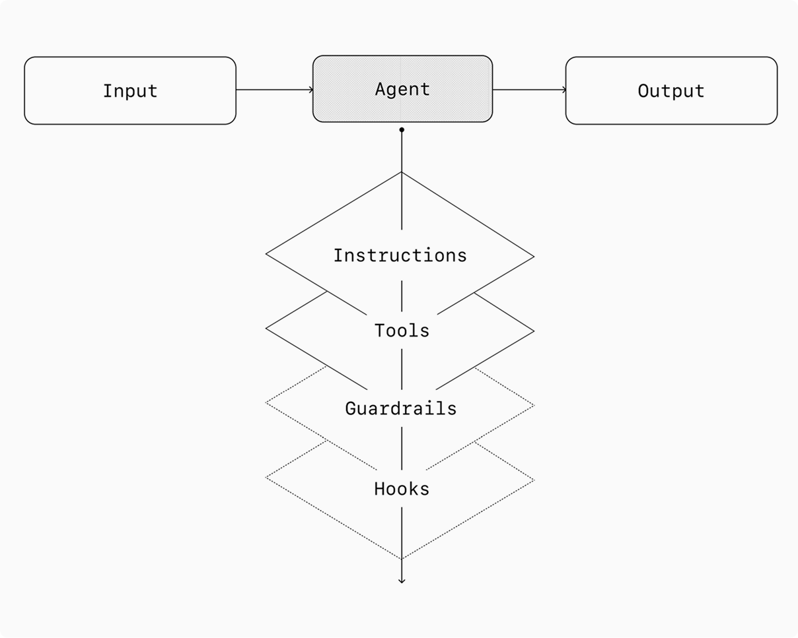
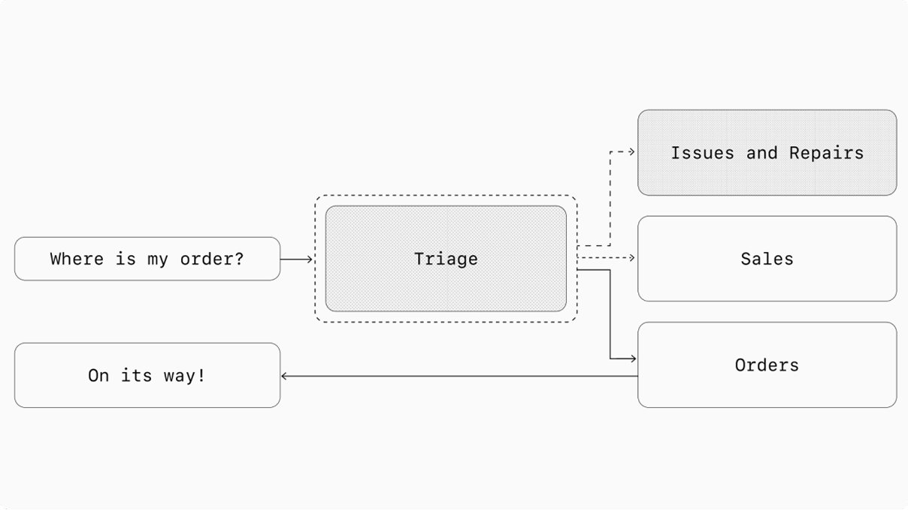

# 第15-16课时｜AI Agent商业革命与未来
## 当$1的Token干了$4,800的活——谁赢？怎么赢？

- 课程时长：90分钟
- 结构：震撼开场 → 商业范式 → 商业模式画布 → AI-native组织 → Agent经济学 → 就业影响 → 技术趋势 → 行动建议

> **核心命题**：AI Agent不是"降本增效工具"——它是经济结构变革。这节课回答：**变革怎么赚钱？谁会赢？你该怎么准备？**

---

<!-- _backgroundColor: #111827 -->
<!-- _color: #f8fafc -->

# 🚀 开场：一个震撼的数字

<br>

## **$1** Token成本

## → **$4,800** 人类专家产出

<br>

### 4,800倍的价值杠杆——这不是降本增效，这是经济结构重写

<div class="tiny muted">来源: <a href="https://arxiv.org/abs/2603.07980" style="color:#93c5fd">$OneMillion-Bench (2026.03)</a></div>

---

# $OneMillion-Bench：从"AI多聪明"到"AI值多少钱"

**为什么传统Benchmark不够了？**

| 维度 | 传统Benchmark | $OneMillion-Bench |
|------|--------------|-------------------|
| 任务类型 | 考试题 / 编程题 | **真实专业工作任务** |
| 覆盖领域 | 通用知识 | 法律、金融、医疗、工业、科学 |
| 任务数量 | 数百~数千 | **400个专家级任务** |
| 评估方式 | 对/错 | **Rubric-based多维评估** |
| 经济含义 | 无 | **量化AI的经济价值** |

> 投资者需要知道的不是"AI多聪明"，而是"AI能赚多少钱"

<div class="tiny muted">来源: <a href="https://arxiv.org/abs/2603.07980">$OneMillion-Bench (2026.03)</a></div>

---

# 什么是"专家级任务"？

不是选择题，是**真实的高薪工作**：

```
传统Benchmark:
  Q: "美国独立宣言是哪一年签署的？"  → A: "1776年"

$OneMillion-Bench:
  Q: "你是跨国药企的合规顾问。FDA刚发布2026版临床试验指南。
      请审查我们Phase III试验的知情同意书模板(50页),
      识别所有不合规条款，给出修改建议。"
      附件: 知情同意书(50页) + FDA新指南(200页)

  评估: 事实准确性 × 逻辑连贯性 × 实践可行性 × 专业合规
```

关键特征：需要**检索权威来源** + **解决冲突证据** + **应用领域规则**

---

# $1 → $4,800 的经济叙事

```
一个专家级任务（如合同审查）的传统成本：
  • 律师时薪: $800
  • 工作时间: 6小时
  • 传统成本: $4,800

Agent完成同一任务：
  • Token成本: ~$1 (含多次搜索、分析、撰写)
  • 完成时间: 30分钟

  ROI = $4,800 / $1 = 4,800x
```

**冷静注意**：这是理论上限。实际要算人工审核成本、系统搭建成本、错误成本

**但核心信号已经足够清晰** → Agent不是"工具"级创新，是"基础设施"级变革

---

# 这节课要回答的三个问题

<br>

### 1️⃣ **这个变革怎么赚钱？**
→ Services as Software，商业模式画布

### 2️⃣ **谁会赢？**
→ AI-native组织 vs 传统+AI，Agent经济学

### 3️⃣ **MBA学生该怎么准备？**
→ 新职业路径 + 技术趋势判断

---

<!-- _backgroundColor: #111827 -->
<!-- _color: #f8fafc -->

# Part 1

## Services as Software
## ——红杉的万亿美元论

<br>

> *"The next trillion-dollar company won't sell software. It will sell work."*
> — Julien Bek, Sequoia Capital (2026.03.05)

---




---

# 红杉最新洞察：Services, The New Software

Sequoia合伙人Julien Bek (2026.03.05)的核心论点：

**企业花费结构**：

```
企业每花 $1 在软件上 → 就花 $6 在服务上

  软件支出: ~$1T/年
  服务支出: ~$6T/年  ← AI Agent要吃掉的部分

传统软件只帮人干活更快
AI Agent直接把活干完
```

**结论**：下一个万亿美元公司不卖软件，**卖工作成果**

<div class="tiny muted">来源: <a href="https://sequoiacap.com/article/services-the-new-software/">Sequoia Capital "Services: The New Software" (2026.03)</a></div>

---

# SaaS → Services as Software

| 维度 | 传统SaaS | Services as Software |
|------|---------|---------------------|
| **卖什么** | 工具使用权 | **工作完成度** |
| **定价** | 按席位/月 | **按任务/结果** |
| **交付** | 软件license | **工作成果** |
| **客户价值** | "用这个干活更快" | **"活已经干完了"** |
| **竞争壁垒** | 功能/品牌 | **行业know-how + 数据飞轮** |
| **规模化** | 招更多销售 | **部署更多Agent** |

> **关键洞察**："最有防御力的公司是软件公司伪装成服务公司"

一个AI Agent替代几十个人类软件license → **per-seat定价模型崩塌**

---

# Copilot → Autopilot：创新者困境

```
2025年: Copilot时代
  • GitHub Copilot: 帮你写代码
  • Office Copilot: 帮你写PPT
  • 核心: 辅助人类，增强效率
  • 商业模式: 在原有SaaS上加收$20-30/月

2026年: 向Autopilot转型
  • OpenAI Codex: 自己写代码
  • Cursor: 理解整个codebase，自主重构
  • 核心: 替代人类，交付成果
  • 商业模式: 按任务/结果收费
```

**创新者困境**：卖"帮你做"很安全，卖"替你做"= 踢走自己的客户

→ 这就是为什么**新公司比老公司更容易抓住这个机会**

---

# 市场规模：数字说话

| 来源 | 预测 | 时间范围 |
|------|------|---------|
| **AI Agent市场** | $7.84B → **$52.62B** | 2025→2030, CAGR 46.3% |
| **BCG** | AI在Tech Services的机会 = **$200B** | 2026报告 |
| **McKinsey** | AI Agent年创造 **$2.6-4.4T** 价值 | 全球经济影响 |
| **红杉** | "Cloud是万亿机会，AI是**十万亿**" | 2026年判断 |

> Jon Radoff "State of AI Agents 2026"：Agent自主工作时长从分钟级增长到**14.5小时**

**当Agent能独立工作14.5小时**——它不再是工具，而是员工

<div class="tiny muted">来源: BCG $200B Report (2026), McKinsey Gen AI Report, Sequoia Capital</div>

---

# Sequoia的恐惧信号

红杉合伙人最近在BusinessInsider的采访中透露：

> "创始人们现在最害怕的不是竞争对手，而是**AI让他们的整个品类消失**"

```
恐惧清单:
  • SaaS创始人: "如果Agent能直接完成工作，客户为什么还需要我的软件？"
  • 服务公司: "如果Agent能做分析/审计/咨询，我的团队还有什么价值？"
  • 投资者: "SaaSPocalypse——Claude每次进步都触发Tech股调整"

但同时:
  • Agent创造的新市场远大于替代的旧市场
  • 问题不是"AI会不会替代"，而是"你站在替代者还是被替代者那边"
```

---

<!-- _backgroundColor: #111827 -->
<!-- _color: #f8fafc -->

# Part 2

## 商业模式画布
## ——用一个案例讲透九个要素

<br>

### 案例：AI法律合同审查公司

---

# 为什么选法律合同审查？

```
市场痛点:
  • 中小律所: 5-20人，无力雇专职合规团队
  • 一份商业合同审查: 传统律师收$500-2,000
  • 审查周期: 2-5天
  • 风险: 人工遗漏率高，疲劳导致错误

AI Agent解决方案:
  • 审查费用: $50-200/份（传统的1/10）
  • 审查时间: 30分钟-2小时
  • 覆盖率: 100%条款覆盖，无遗漏
  • 标杆: Harvey AI估值$1.5B, 已证明市场需求
```

**注意**：我们不是在卖"合同分析软件"——我们卖的是"**合同审查完成**"

---

# 商业模式画布：9个要素

<!-- 图示建议：绘制标准Business Model Canvas九宫格 -->

```
┌──────────────┬──────────────┬──────────────┬──────────────┬──────────────┐
│  关键合作伙伴 │  关键活动    │              │  客户关系    │  客户细分    │
│              │              │  价值主张    │              │              │
│  法律数据库  │  模型训练    │              │  按任务付费  │  中小律所    │
│  合规标准机构│  Skill维护   │  不卖软件    │  满意才收钱  │ (5-20人)    │
│  律师协会    │  合规更新    │  卖审查完成  │  专属客户经理│  合规密集型  │
│              │  质量门禁    │              │              │  企业        │
├──────────────┤──────────────┤              ├──────────────┤──────────────┤
│  关键资源    │              │              │  渠道        │              │
│              │              │              │              │              │
│  Agent Harness│             │              │  API集成     │              │
│  法律知识Skill│             │              │  律所管理系统│              │
│  持续学习引擎│              │              │  行业展会    │              │
│              │              │              │              │              │
├──────────────┴──────────────┴──────────────┴──────────────┴──────────────┤
│  成本结构                         │  收入模式                           │
│  API费用(30%) + 开发(25%)        │  per-contract审查费 $50-200/份      │
│  合规(20%) + 运营(25%)           │  月度订阅包（大客户）               │
│                                   │  增值: 合规趋势报告、定制模板       │
└───────────────────────────────────┴─────────────────────────────────────┘
```

---

# 画布深度解读①：价值主张

**关键转变**：从"工具"到"成果"

```
传统SaaS思维:
  "我们提供AI合同分析平台，支持智能标注、条款比对、风险评分"
  → 客户还得学怎么用，自己做判断

Services as Software思维:
  "你把合同发过来，我30分钟内告诉你：
   - 3个高风险条款（附修改建议）
   - 2个缺失条款（附补充模板）  
   - 1份合规评估报告
   合格才收费。"
  → 客户只关心结果
```

> 核心区别：**卖锤子** vs **卖钉好的钉子**

---

# 画布深度解读②：收入模式

| 模式 | 定价 | 适用客户 | 毛利 |
|------|------|---------|------|
| **按件计费** | $50-200/份 | 中小律所、偶发需求 | ~70% |
| **月度订阅** | $2,000-5,000/月 | 中型律所、稳定量 | ~75% |
| **企业定制** | $20K-50K/月 | 大型企业法务 | ~60% |

**对比传统**：

```
传统律师: $500-2,000/份, 2-5天
AI审查:   $50-200/份,   30分钟-2小时

客户节省: 75-90%成本, 90%+时间
我们毛利: 60-75%

这是典型的"双赢经济"——客户省钱,我们赚钱
```

---

# 画布深度解读③：关键资源与活动

**关键资源**：

| 资源 | 说明 | 壁垒等级 |
|------|------|---------|
| **Agent Harness** | 任务拆解→调度→质量门禁→交付 | ⭐⭐⭐⭐ |
| **法律知识Skill** | 各法域合规规则、判例库 | ⭐⭐⭐⭐⭐ |
| **持续学习引擎** | 法规更新自动同步、错误反馈学习 | ⭐⭐⭐⭐ |
| **标注数据** | 律师审核过的合同标注（飞轮核心） | ⭐⭐⭐⭐⭐ |

**关键活动**：
- 模型训练 & Fine-tuning（持续）
- Skill维护 & 合规更新（法规变化时）
- 质量门禁设计（人工审核 → 自动化验收）
- 客户反馈闭环（每次纠错都让系统更强）

---

# 泛化：Agent Business的通用画布框架

| 画布要素 | Agent Business通用模式 |
|---------|----------------------|
| **价值主张** | 卖**工作完成**，不卖工具使用权 |
| **客户细分** | 找"请不起专家但需要专家级服务"的客户 |
| **收入模式** | **按结果/任务计费**，而非按席位/月 |
| **关键资源** | Agent Harness + 行业知识Skill + 数据飞轮 |
| **关键活动** | 持续训练 + Skill维护 + 质量门禁 |
| **成本结构** | API成本(30%) + 人力(25%) + 合规(20%) + 运营(25%) |
| **壁垒** | 行业know-how + 标注数据 + 客户关系 |
| **渠道** | API集成 > 独立产品 > 平台分发 |

> **最深的护城河**：不是模型，是**行业数据飞轮** + **客户信任**

---

<!-- _backgroundColor: #111827 -->
<!-- _color: #f8fafc -->

# Part 3

## AI-native组织



## ——不是空谈，用案例说话

<br>

### 3人+Agent集群 = 100万行代码

---

# 案例1：OpenAI Codex团队

```
传统软件团队:
  100万行代码 = 50人团队 × 1年
  成本: ~$10M (硅谷平均)

OpenAI Codex实验:
  100万行代码 = 3→7人 + Agent集群 × 5个月
  成本: ~$1M (人力+API)

效率: 10x-20x
```

**关键不是"AI写代码更快"——而是组织范式变了**：

- 人的角色：从"写代码"变成"设计任务 + 审核结果"
- Agent的角色：从"辅助补全"变成"独立编写 + 测试 + 修Bug"
- 扩展方式：从"招更多人"变成"部署更多Agent"

---

# 案例2：Cursor——2年从0到$100M ARR

```
Cursor增长曲线:
  2024.01: 发布初期
  2025.01: ARR突破$100M  ← 仅用2年！
  2025.12: 估值$50B

对比SaaS时代:
  Salesforce: 17年到$1B ARR
  Slack: 7年
  Cursor: 2年到$100M, 估值$50B

为什么这么快？
  1. 边际成本极低 → 扩张无物理约束
  2. 产品即壁垒 → 用户越多，代码理解越强
  3. 替代效应 → 不是"多一个功能"，而是"替代一个工作模式"
```

<div class="tiny muted">来源: Cursor估值数据, SaaS增长基准对比</div>

---

# 案例3：Zapier——89%全公司AI采纳

```
Zapier AI部署 (2026):
  • 全公司AI采纳率: 89%
  • 部署Agent数量: 800+
  • 覆盖: 营销、客服、工程、运营、法务

关键成功因素:
  • CEO亲自推动 ("不会用AI的人无法在这里工作")
  • 每个团队有AI Champion
  • 按能力域分Agent，不按部门分人
```

**不是"给员工一个AI工具"，而是"用Agent重新设计每个工作流"**

<div class="tiny muted">来源: Zapier 2026 AI Adoption Report</div>

---

# 案例4：Anthropic法务团队

```
传统法务流程:
  合同审核 → 律师手动逐条审查 → 标注风险 → 写意见
  周期: 2-3天

Anthropic法务团队 (2026):
  律师自己用Claude Code构建工具
  合同审核 → Agent自动审查+标注 → 律师审核关键点 → 出意见
  周期: 24小时

关键洞察:
  不是IT部门给法务部署了AI
  是律师自己成了"Harness工程师"
  → 每个专业人士都需要学会构建自己的Agent
```

---

# 案例5：TELUS——企业级规模验证

```
TELUS (加拿大最大电信公司之一):
  • AI Agent节省工时: 500,000+ 小时/年
  • 覆盖: 客服、网络运维、内部流程
  • ROI: 企业级验证

这不是创业公司的demo——
这是年收入$20B+的大企业在生产环境中的真实数据
```

> 当大企业开始用Agent节省50万小时——这个趋势已经不可逆了

---

# AI-native vs 传统+AI：对比表

| 维度 | 传统+AI | AI-native |
|------|---------|-----------|
| **AI角色** | 辅助工具 | **核心劳动力** |
| **人的角色** | 执行者 | **设计者/掌舵者** |
| **团队规模** | 50人+AI工具 | **3-7人+Agent集群** |
| **工作方式** | 人写代码/报告 | 人设计任务，Agent执行 |
| **质量保证** | 人工Review | 自动化测试+Agent Review |
| **扩展方式** | 招更多人 | **部署更多Agent** |
| **成本结构** | $5M/年人力 | **$1M人力+$0.3M API** |
| **迭代速度** | 周级 | **小时级** |

---

# 新组织设计原则

### 1. 人数少、Agent多
3-7人核心团队 + 50-200个Agent → 抵得上50-100人传统团队

### 2. 人做决策、Agent做执行
人负责"做什么"和"够不够好"，Agent负责"怎么做"

### 3. 按能力域分Agent、不按部门分人
不再有"市场部"、"技术部"——而是"市场Agent集群"、"技术Agent集群"

### 4. 新管理技能

| 传统管理 | Agent时代管理 |
|---------|-------------|
| 面试评估能力 | 选择模型+设计Prompt |
| 制定KPI | 定义验收标准 |
| 1:1沟通 | 监控日志+调参 |
| 绩效考核 | A/B测试+指标追踪 |

---

<!-- _backgroundColor: #111827 -->
<!-- _color: #f8fafc -->

# Part 4

## Agent经济学
## ——精简版，看结构不算账

<br>

### 重要的不是ROI公式，是结构性影响

---

# 单位经济学：一张表说清楚

| 指标 | Agent | 人类 | 差异 |
|------|-------|------|------|
| **每任务成本** | $0.01-$10 | $50-$500 | 10-50,000x |
| **响应时间** | 秒-分钟 | 小时-天 | 100-1,000x |
| **可用性** | 24/7/365 | 8/5/250 | 5x+ |
| **扩展速度** | 即时 | 月级招聘 | 无限 vs 线性 |
| **一致性** | 极高 | 波动 | Agent不会疲劳/情绪波动 |
| **判断力** | 有限 | 强 | 人类仍有优势 |

> 简化ROI公式：**ROI = (替代人力成本 + 效率提升) / (开发成本 + API费用 + 运维)**

典型场景：5-12个月回收投资，第二年200%+ ROI

---

# 更重要的：结构性影响

### 1️⃣ Per-seat SaaS定价模型崩塌

```
传统: 50人公司 × $30/人/月 = $1,500/月 → SaaS厂商收入

Agent时代: 5人公司 + Agent集群 → 做同样多的工作
  → SaaS只能收5个席位 = $150/月
  → 或者，转型为"按任务/结果收费"
```

### 2️⃣ 人力密集型服务被Agent替代
咨询、审计、客服、数据分析——这些**按人头计费的行业**将被重新定价

### 3️⃣ "SaaSPocalypse"
Claude每次重大进步都触发Tech股调整——$1T+市值蒸发
但这只是**价值转移**，不是价值消失

---

# Agent创造的新市场 > 替代的旧市场

```
被替代/压缩的市场:
  • 传统SaaS per-seat收入: 压缩50-80%
  • 初级知识工作外包: 大幅萎缩
  • 规模: 数千亿美元

被创造的新市场:
  • Services as Software: $6T可触达市场
  • Agent-native产品: 全新品类
  • 具身智能: $20B+资金涌入
  • 规模: 万亿美元级

净效应: 大幅正向
```

> 每次技术革命都是如此：汽车消灭了马车夫，但创造了百倍的新就业

---

<!-- _backgroundColor: #111827 -->
<!-- _color: #f8fafc -->

# Part 5

## 对就业和职业的影响
## ——裁员潮与新岗位并存

---

# AI裁员潮：数字触目惊心

| 年份 | AI相关裁员人数 | 增长 |
|------|---------------|------|
| 2023 | ~4,500人 | 基准 |
| 2024 | ~12,000人 | 2.7x |
| **2025** | **55,000人** | **12x** |

**典型案例**：
- **Block** (Jack Dorsey)：裁员40%，CEO公开称AI效率提升
- **Amazon**：优化运营和客服岗位
- **Pinterest**：削减内容审核团队
- **Klarna**：AI客服 = 700名全职员工产出，年省$4000万

Jack Dorsey预测：**"其他公司会跟进"**

<div class="tiny muted">来源: 2025年AI裁员数据汇总, Block/Klarna财报</div>

---

# 但同时：Agent创造了新岗位

| 新岗位 | 职责 | 薪资参考(硅谷) |
|--------|------|---------------|
| **Harness工程师** 🆕 | 构建Agent执行环境、设计Skill | $180-280K |
| **Agent训练师** | Prompt工程、Fine-tuning、质量优化 | $150-250K |
| **AI产品经理** | 设计人机交互、定义Agent能力边界 | $180-300K |
| **人机协作设计师** | 设计人与Agent的协作流程 | $160-260K |
| **Agent运维** | 监控Agent集群、成本优化、异常处理 | $140-220K |
| **AI伦理官** | Agent安全合规、偏见审计 | $170-280K |

> **Harness工程师**是2026年最热门的新职业——它就像2010年的"iOS开发者"

---

# MBA学生的四条路径

| 路径 | 描述 | 核心技能 | 风险/回报 |
|------|------|---------|----------|
| **AI产品经理** | 设计Agent产品，定义人机交互 | Prompt设计 + 产品sense | 中/高 |
| **AI战略顾问** | 帮企业制定AI落地路线图 | AI能力评估 + ROI分析 | 低/中 |
| **AI创业者** | 识别垂直机会，构建Agent business | 行业know-how + 技术理解 | 高/极高 |
| **行业+AI复合人才** | 深耕行业，叠加AI应用能力 | 领域专业 + AI素养 | **最低/最稳** |

> 最难被替代的不是"会用AI的人"，而是"能设计让AI创造价值的系统的人"

---

<!-- _backgroundColor: #111827 -->
<!-- _color: #f8fafc -->

# Part 6

## AI技术发展趋势与商业影响
## ——多讲趋势，这是MBA必须理解的

<br>

### 从有趣的工具 → 标准基础设施

---

# 趋势1：推理能力爆发

```
推理能力演进:

2023: GPT-4          → "能理解，会犯错"
2024: o1/o3          → "能推理，偶尔出错"  
2025: DeepSeek-R1    → "开源追上闭源"
2025: GPT-5          → "准确度质变"
2026: GPT-5 Turbo    → "成本降90%，性能持平"

关键转折点 (2025-2026):
  • 数学推理: 从"偶尔对"到"基本不错"
  • 代码生成: 从"能写函数"到"能写系统"
  • 专业任务: 从"辅助参考"到"可直接使用"
```

**商业影响**：当推理准确度跨过阈值，从"有趣的demo"变成"可生产使用"→ 市场突然爆发

---

# 趋势2：Agent自主时长——从分钟到14.5小时

```
Agent自主工作时长演进:

2024: 分钟级
  • 回答一个问题 (秒)
  • 写一段代码 (分钟)
  • 一次搜索整合 (分钟)

2025: 小时级
  • 深度研究报告 (1-2小时)
  • 代码项目 (数小时)

2026: 14.5小时 (Jon Radoff数据)
  • 独立完成复杂项目
  • 跨session连续工作
  • 自主规划、执行、纠错
```

> **14.5小时意味着什么？** → Agent可以在你睡觉的时候完成一天的工作

<div class="tiny muted">来源: Jon Radoff "State of AI Agents 2026"</div>

---

# 趋势3：多模态Agent

```
Agent感知能力演进:

2024: 文本为主
  → 读文档、写报告

2025: 图文视频
  → 看图分析、理解视频内容

2026: 全模态 + UI操作
  → 看屏幕、点按钮、填表单、打电话
  → Claude Computer Use、OpenAI Operator

商业含义:
  • 不需要API集成 → Agent直接操作现有软件
  • 自动化范围从"有API的系统"扩展到"所有有界面的系统"
  • 遗留系统也能被Agent操作 → 降低企业AI部署门槛
```

---

# 趋势4：具身智能——数字Agent进入物理世界

| 公司 | 产品 | 估值/融资 | 进展 |
|------|------|----------|------|
| **Figure** | 人形机器人Figure 02 | $2.6B (2024) | 与BMW合作工厂部署 |
| **Tesla** | Optimus | Tesla一部分 | 2026年工厂内测 |
| **SkildAI** | 机器人基础模型 | **$14B** (2025) | 通用robot foundation model |
| **Unitree** (宇树) | Go2/H1 | — | 中国最快商业化 |

```
资金规模: $20B+ 涌入具身智能赛道

关键判断:
  数字Agent解决了"脑"的问题
  具身智能解决"手"的问题
  两者结合 = AI从屏幕走进物理世界
  → 这是下一个万亿美元市场
```

<div class="tiny muted">来源: SkildAI $14B估值(2025), Figure AI融资数据</div>

---

# 趋势5：Agent协议演进

```
Agent协议三层架构:

Layer 1: MCP (Model Context Protocol) — 工具层 ✅ 已成熟
  • Agent ↔ 工具/数据源
  • 标准化工具调用接口
  • Anthropic主推，已成为行业标准

Layer 2: A2A (Agent-to-Agent) — 通信层 🔄 发展中
  • Agent ↔ Agent
  • Google主推，跨Agent任务协作
  • 企业间Agent互操作

Layer 3: ??? — 社会层 🔮 未来
  • Agent社会: 合作、竞争、交易
  • Agent经济: 自动定价、自动签约、自动结算
  • Agent信任: 声誉系统、能力认证
```

> Agent之间开始形成"社会"——这不是科幻，这是正在发生的事

---

# 趋势6：AI安全与治理

| 动态 | 时间 | 含义 |
|------|------|------|
| **NIST AI Agent Standards Initiative** | 2026.02 | 美国开始制定Agent行业标准 |
| **欧盟AI Act正式生效** | 2026.02 | 高风险AI应用需合规认证 |
| **Lakera审计** | 2026 | 揭示Skill生态安全风险（注入攻击等） |

```
为什么MBA学生要关注安全？

1. 合规成为竞争壁垒
   → 能通过AI Act认证的公司有先发优势

2. 安全事故成本极高
   → Agent越自主，出错后果越严重

3. 治理能力 = 商业信任
   → 企业客户优先选择"可治理"的Agent服务
```

---

# 六大趋势汇总：关键判断

| 趋势 | 当前阶段 | 2028预测 | 商业影响 |
|------|---------|---------|---------|
| 推理能力 | GPT-5级别 | 超越人类专家 | 专业服务全面可替代 |
| 自主时长 | 14.5小时 | 多天连续工作 | Agent = 全职员工 |
| 多模态 | 图文+UI操作 | 全模态统一 | 任何系统都可自动化 |
| 具身智能 | 工厂试点 | 商业化扩展 | $1T+新市场 |
| 协议演进 | MCP+A2A | Agent社会 | 跨组织Agent协作 |
| 安全治理 | 标准制定 | 合规强制 | 合规=竞争壁垒 |

> **红杉的判断**："Cloud was a trillion-dollar opportunity. **AI is ten trillion.**"

---

<!-- _backgroundColor: #111827 -->
<!-- _color: #f8fafc -->

# Part 7

## 课程总结 + 行动建议

---

# 两天课程回顾

**第一天（技术基础）**：
1. LLM基础：Transformer → GPT-5
2. Prompt工程：零成本提效的第一步
3. RAG：让AI拥有私有知识
4. Agent架构：ReAct、反思、规划
5. 记忆与工具：突破LLM限制

**第二天（系统与商业）**：
1. 多Agent系统：分工协作
2. MCP与Skill：能力扩展协议
3. LLM OS：新计算范式
4. **商业革命**：Services as Software → AI-native组织 → Agent经济学 → 技术趋势

> 从"AI怎么工作"到"AI怎么赚钱"

---

<!-- _backgroundColor: #111827 -->
<!-- _color: #f8fafc -->

# 三个带走的核心洞察

<br>

## 1️⃣ "下一个万亿美元公司卖工作，不卖软件"
SaaS → Services as Software，$6T可触达市场

<br>

## 2️⃣ "AI-native组织：3人+Agent集群 > 50人传统团队"
不是用AI增强旧组织，而是用Agent重新设计组织

<br>

## 3️⃣ "你的竞争力不是会用AI，而是能设计让AI创造价值的系统"
从"使用者"升级为"设计者"

---

# 行动建议：三个时间框架

### 🔥 本周
- [ ] 用AI Agent完成一个你平时需要2+小时的工作任务
- [ ] 阅读红杉 "Services: The New Software" 原文

### 📈 本月
- [ ] 画出你所在行业的"Agent商业模式画布"
- [ ] 找一个真实业务场景，估算Agent部署的ROI

### 🚀 本季度
- [ ] 学会一个Agent开发框架（LangChain / CrewAI / OpenClaw）
- [ ] 做一个AI项目原型，哪怕只是一个Prompt模板
- [ ] 建立你的"行业+AI"专业声誉——写文章、做分享、发LinkedIn

---

# 如果你只记住一句话

<br>

> ## "AI Agent不是让你的工作更快——
> ## 它让你的工作不再需要你。
> ## 
> ## 问题是：**你在替代者那边，还是被替代者那边？**"

<br>

### 答案取决于你接下来的选择。

---

# 课后作业

### 商业计划书（1页）

1. **选择一个行业**：你熟悉的、有痛点的
2. **设计Agent方案**：用Services as Software思维
3. **画商业模式画布**：9个要素全填
4. **估算经济账**：成本结构 + 收入模式 + 简化ROI
5. **分析竞争**：壁垒在哪？谁是潜在竞争者？

> 提示：最好的商业机会 = **"请不起专家但需要专家级服务"**的市场

---

# 延伸阅读

### 必读
- [Sequoia "Services: The New Software"](https://sequoiacap.com/article/services-the-new-software/) — 2026年最重要的商业洞察
- [$OneMillion-Bench](https://arxiv.org/abs/2603.07980) — AI经济价值的新标尺
- [BCG: The $200B AI Opportunity](https://www.bcg.com/publications/2026/the-200-billion-dollar-ai-opportunity-in-tech-services)

### 推荐
- Jon Radoff "State of AI Agents 2026" — Agent趋势全景
- McKinsey "The Economic Potential of Generative AI" — 宏观影响
- NIST AI Agent Standards Initiative (2026.02) — 治理框架

---

<!-- _backgroundColor: #111827 -->
<!-- _color: #f8fafc -->

# Q&A

<br>

## 你有什么问题？

<br>

### 关于商业模式？技术趋势？职业选择？创业机会？

<br>

> *"The best time to understand AI was two years ago. The second best time is now."*

---

# 备用讨论页：课堂互动题

### 🤔 讨论1（3分钟）
"如果你是一家50人咨询公司的CEO，你会如何重新设计公司？用多少人+多少Agent？"

### 🤔 讨论2（3分钟）
"哪个行业最容易被Services as Software颠覆？为什么？"

### 🤔 讨论3（3分钟）
"如果Agent能独立工作14.5小时，管理者的角色是什么？"

---

# 备用页：详细ROI计算示例

**场景**：部署AI合同审查Agent

| 项目 | 金额 |
|------|------|
| **成本**（第一年） | |
| 开发费（一次性） | $100,000 |
| API费用（$5K/月） | $60,000 |
| 运维人力 | $80,000 |
| **年度总成本** | **$240,000** |
| **收益**（第一年） | |
| 替代3名初级律师 | $240,000 |
| 效率提升（剩余2人） | $50,000 |
| 新增客户（审查能力扩展） | $60,000 |
| **年度总收益** | **$350,000** |
| **ROI** | **46%** |
| **回收期** | **~8个月** |

---

# 备用页：Agent安全风险矩阵

| 风险类型 | 说明 | 严重度 | 缓解措施 |
|----------|------|--------|---------|
| **幻觉** | Agent生成错误信息 | 高 | RAG验证、人工审核 |
| **越权** | 执行未授权操作 | 极高 | 权限控制、审批流程 |
| **注入攻击** | 恶意Prompt劫持Agent | 高 | 输入过滤、Skill审计 |
| **数据泄露** | 敏感信息通过Agent外传 | 极高 | 数据脱敏、访问控制 |
| **成本失控** | API费用暴增 | 中 | 预算限制、监控告警 |
| **偏见** | 输出存在歧视 | 高 | 多样性测试、审计 |

> Lakera 2026审计揭示：Skill生态中普遍存在注入攻击风险——安全是Agent商业化的前提

---

# 备用页：全球AI治理动态

| 地区 | 框架 | 对Agent的影响 |
|------|------|-------------|
| **欧盟** | AI Act (2026生效) | 高风险Agent需认证，合规成本↑ |
| **美国** | NIST Standards + 行政命令 | 行业自律为主，标准逐步建立 |
| **中国** | 算法备案 + 内容审核 | Agent需备案，数据本地化 |
| **英国** | Pro-innovation approach | 灵活监管，鼓励创新 |

**MBA视角**：合规不是成本，是壁垒。率先满足监管要求的公司将获得企业客户信任。

---

# 附录：关键数据来源

| 数据点 | 来源 |
|--------|------|
| $1 Token → $4,800价值 | $OneMillion-Bench (arXiv:2603.07980) |
| Services as Software | Sequoia, Julien Bek (2026.03.05) |
| $7.84B→$52.62B市场 | AI Agent Market Report, CAGR 46.3% |
| $200B AI机会 | BCG Tech Services Report (2026) |
| $2.6-4.4T年创造价值 | McKinsey Gen AI Report |
| Agent自主14.5小时 | Jon Radoff "State of AI Agents 2026" |
| Cursor $50B估值 | Cursor融资数据 (2025) |
| Zapier 89%/800 agents | Zapier AI Adoption Report |
| TELUS 500K工时 | TELUS年报 |
| 2025裁员55,000人 | AI裁员数据汇总 |
| SkildAI $14B | SkildAI融资 (2025) |
| Block裁员40% | Block/Jack Dorsey声明 |
